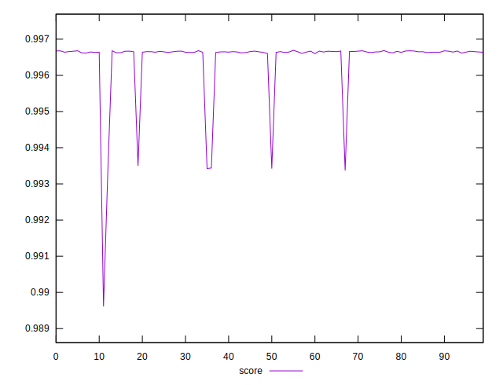
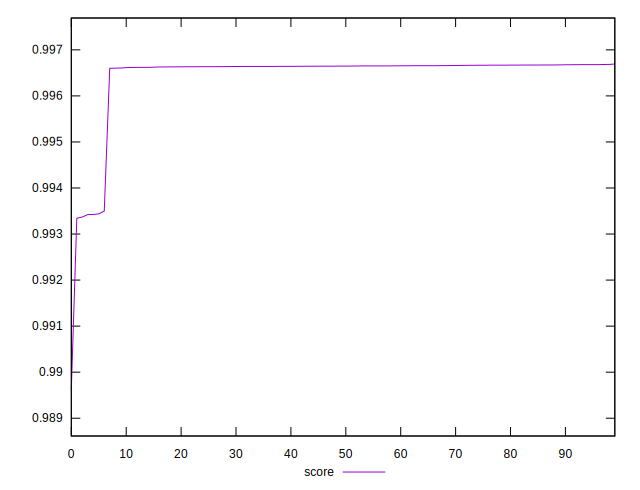
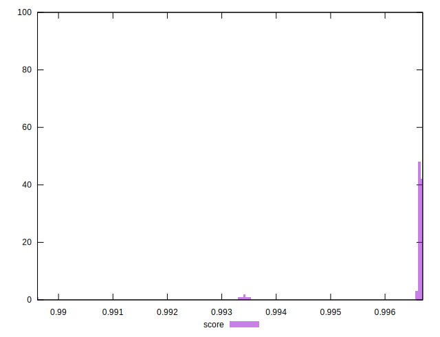

# //interactive/samples/pages+cached+noexternal+nosvg

[→ Parent](../..)


## Raw


```yaml
p90min: 1814.9948000000002
p90max: 1822.088
p90range: 7.093199999999797
p90mean: 1818.6928133333336
p90median: 1818.758
p90stdev: 1.6121943044738052
p90skewness: -0.0642170587749993
p90eccentricity: 1.0000000000000002
p90discretization: 1
outlandishness: 1.0199690646935642

```


## Score


```yaml
p90min: 0.9896137682078787
p90max: 0.9966730461681509
p90range: 0.00705927796027217
p90mean: 0.9963530315735216
p90median: 0.9966445968050825
p90stdev: 0.0010768127438017462
p90skewness: -4.0586115899964375
p90eccentricity: 1
p90discretization: 1
outlandishness: 1.0000657442672807

```

