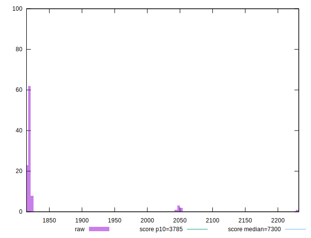

# //interactive/samples/pages+cached+noexternal+nosvg

[→ Parent](../..)


## Raw


```yaml
p90min: 1815.9042
p90max: 1823.5164
p90range: 7.61220000000003
p90mean: 1818.9149109890104
p90median: 1818.8148
p90stdev: 1.7152605995226635
p90skewness: 0.32714169268011695
p90eccentricity: 1.0000000000000002
p90discretization: 1
outlandishness: 1.019719994320418

```


## Score


```yaml
p90min: 0.9965992431136814
p90max: 0.9966819174847706
p90range: 0.00008267437108921971
p90mean: 0.9966493584489091
p90median: 0.9966504811800735
p90stdev: 0.000018606455953039682
p90skewness: -0.33683497135900714
p90eccentricity: 0.9999999999999992
p90discretization: 1
outlandishness: 0.9994711473825081

```

