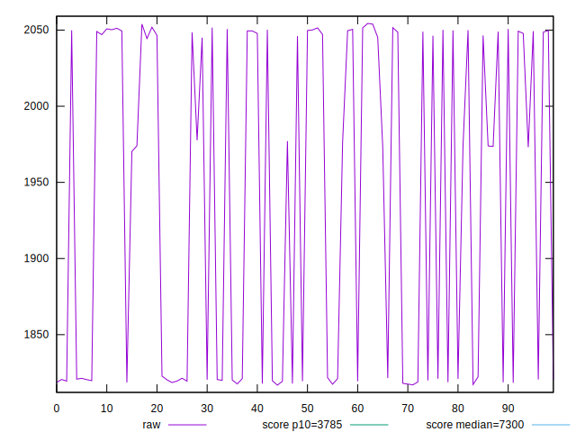
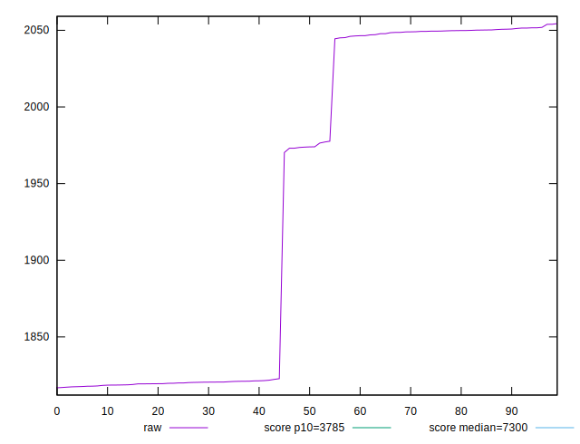
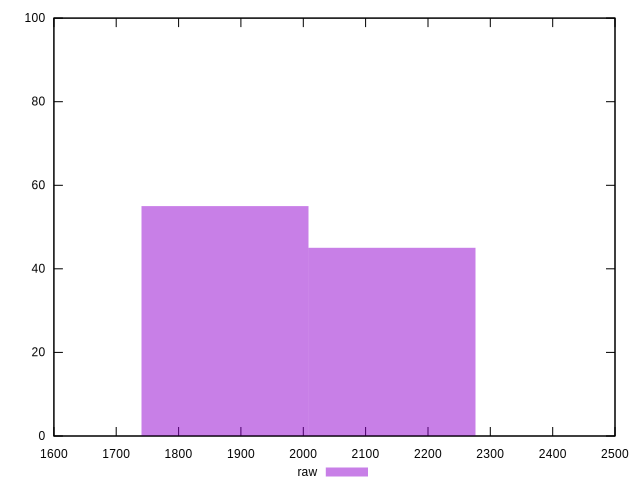
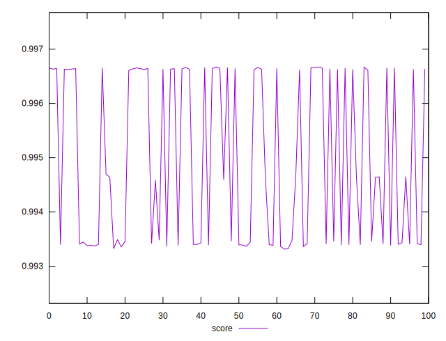
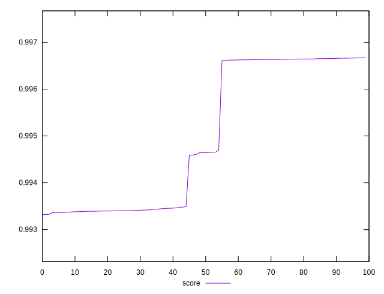
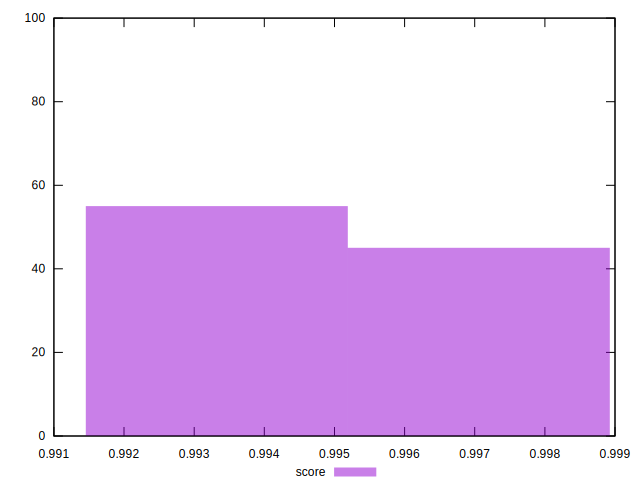

# //interactive/samples/pages+cached+noexternal

[→ Parent](../..)


## Raw


```yaml
p90min: 1816.8288000000002
p90max: 2050.72535
p90range: 233.89654999999993
p90mean: 1925.8666177777768
p90median: 1896.54415
p90stdev: 108.45821284236007
p90skewness: 0.10381697655199733
p90eccentricity: 1.0000000000000002
p90discretization: 1
outlandishness: 1.0131663526684793

```


## Score


```yaml
p90min: 0.9933164666291344
p90max: 0.996653371791028
p90range: 0.0033369051618935552
p90mean: 0.9947974042399134
p90median: 0.994037542620648
p90stdev: 0.0015125491734777363
p90skewness: 0.3056695468401708
p90eccentricity: 1.0000000000000002
p90discretization: 1
outlandishness: 1.0003752596402242

```

