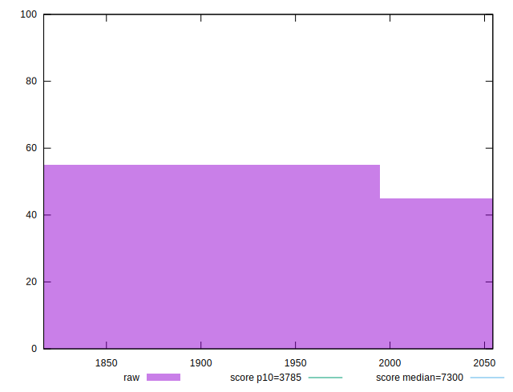
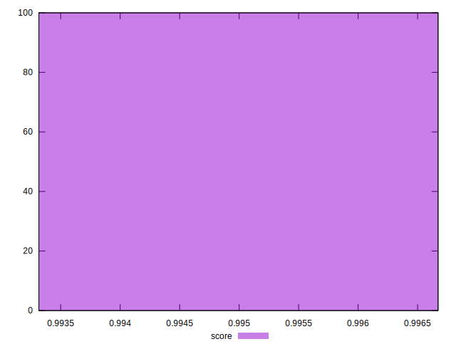

# //interactive/samples/pages+cached+noexternal

[→ Parent](../..)


## Raw


```yaml
p90min: 1818.3901999999998
p90max: 2054.36825
p90range: 235.97805000000017
p90mean: 1950.471074725274
p90median: 1977.6609999999998
p90stdev: 107.80563715983902
p90skewness: -0.31452020950890935
p90eccentricity: 0.9999999999999997
p90discretization: 1
outlandishness: 0.9877661537174199

```


## Score


```yaml
p90min: 0.9933164666291344
p90max: 0.9966550805990397
p90range: 0.003338613969905313
p90mean: 0.9948178182658377
p90median: 0.9945841649864157
p90stdev: 0.0015166312039445976
p90skewness: 0.27968761349562166
p90eccentricity: 0.9999999999999999
p90discretization: 1
outlandishness: 1.0003342039281549

```


## P Score


```yaml
p90min: 0.9933164666291344
p90max: 0.9966550805990397
p90range: 0.003338613969905313
p90mean: 0.9948178182658377
p90median: 0.9945841649864157
p90stdev: 0.0015166312039445976
p90skewness: 0.27968761349562166
p90eccentricity: 0.9999999999999999
p90discretization: 1
outlandishness: 1.0003342039281549

```


## Score Difference


```yaml
p90min: -0.004584164986415673
p90max: 0.0033927991472320063
p90range: 0.00797696413364768
p90mean: -0.00007292048382608677
p90median: -0.003316466629134429
p90stdev: 0.003396276070890546
p90skewness: 0.01749561718950948
p90eccentricity: 0.9999999999999999
p90discretization: 1
outlandishness: 44.06199144972688

```


## P Score Difference


```yaml
p90min: 0
p90max: 0
p90range: 0
p90mean: 0
p90median: 0
p90stdev: 0
p90skewness: .nan
p90eccentricity: .nan
p90discretization: 91
outlandishness: .nan

```

