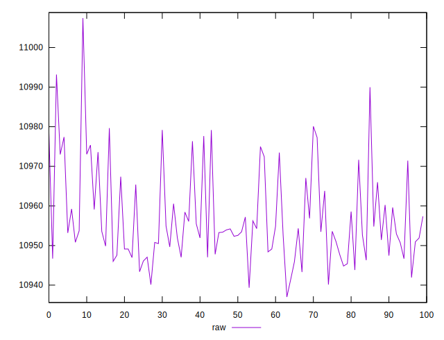
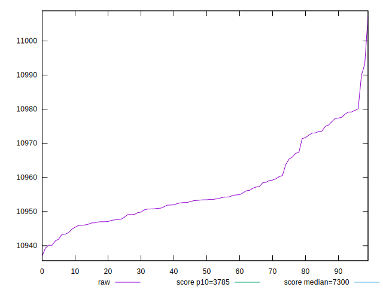
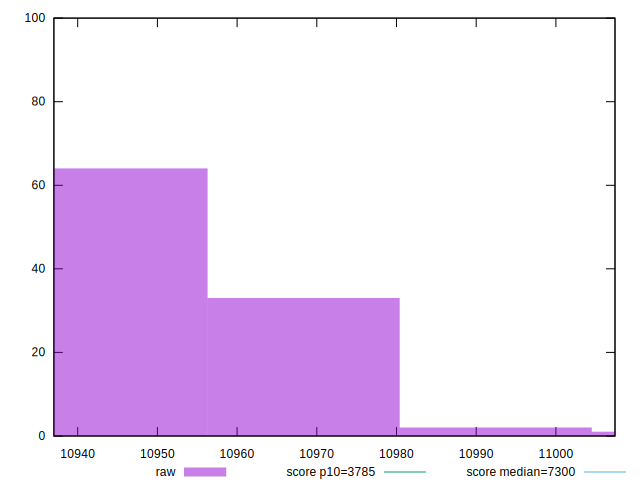
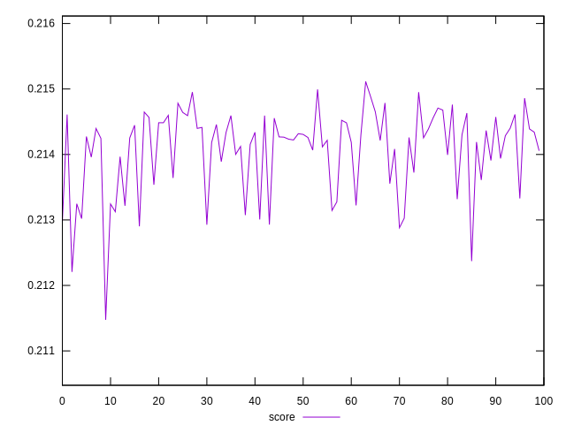
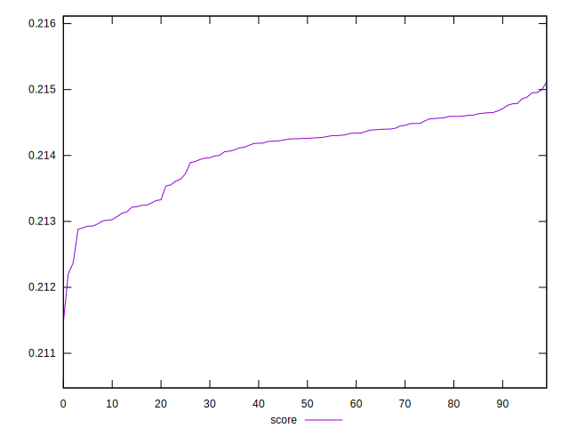
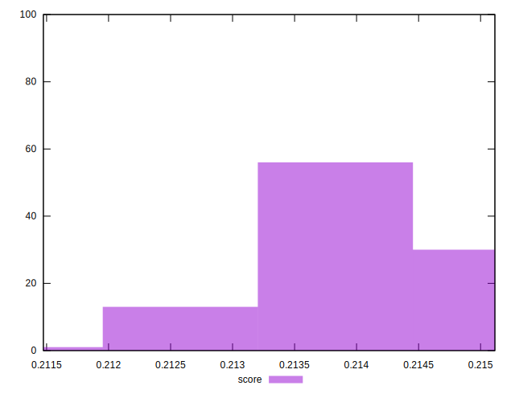

# //interactive/samples/pages+cached+nointeractive

[→ Parent](../..)


## Raw


```yaml
p90min: 10939.342299999997
p90max: 10977.644699999997
p90range: 38.30240000000049
p90mean: 10955.07514065934
p90median: 10953.1874
p90stdev: 9.772360704996954
p90skewness: 0.8619267696136578
p90eccentricity: 1
p90discretization: 1
outlandishness: 1.0004173002422108

```


## Score


```yaml
p90min: 0.21300695063511488
p90max: 0.21499417432361845
p90range: 0.00198722368850357
p90mean: 0.21417635024474874
p90median: 0.21427381423169067
p90stdev: 0.0005069207689273001
p90skewness: -0.85796394973329
p90eccentricity: 0.9999999999999999
p90discretization: 1
outlandishness: 0.9988965145113877

```

