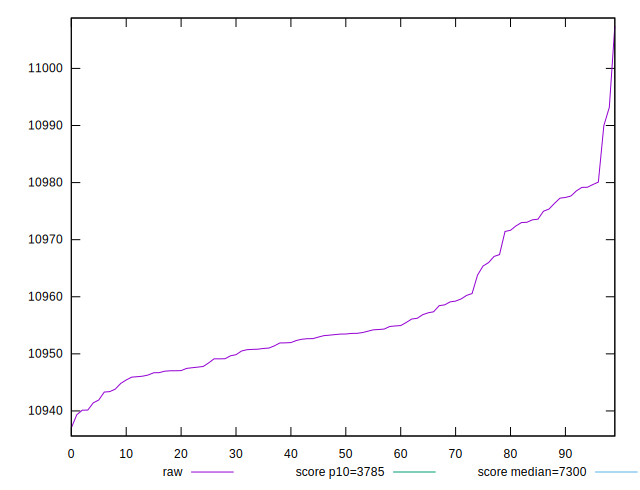
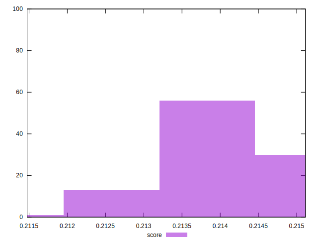

# //interactive/samples/pages+cached+nointeractive

[→ Parent](../..)


## Raw


```yaml
p90min: 10937.018799999996
p90max: 10977.265300000001
p90range: 40.246500000004744
p90mean: 10954.375701111108
p90median: 10952.80155
p90stdev: 9.407256845760815
p90skewness: 0.819939817424812
p90eccentricity: 1.0000000000000004
p90discretization: 1
outlandishness: 1.0005450580958082

```


## Score


```yaml
p90min: 0.21147431610455303
p90max: 0.21467732828981312
p90range: 0.00320301218526009
p90mean: 0.2139668110875302
p90median: 0.21422725965505074
p90stdev: 0.0006459936290865736
p90skewness: -1.314206704850147
p90eccentricity: 0.9999999999999999
p90discretization: 1
outlandishness: 1.0008539248319726

```

