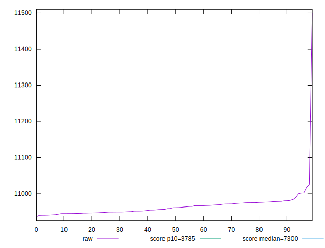
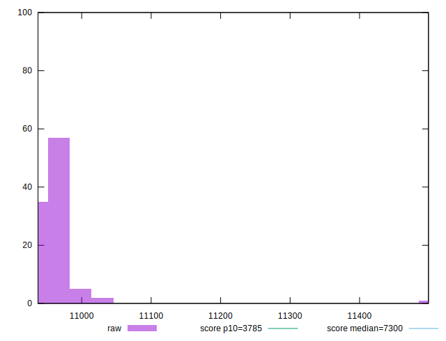
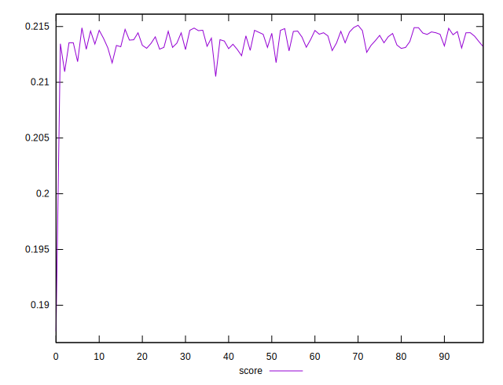

# //interactive/samples/pages+cached

[→ Parent](../..)


## Raw


```yaml
p90min: 10937.099700000002
p90max: 10980.511599999998
p90range: 43.41189999999551
p90mean: 10959.133932222221
p90median: 10956.864599999997
p90stdev: 12.324249801021145
p90skewness: 0.15028685775209796
p90eccentricity: 1.0000000000000002
p90discretization: 1
outlandishness: 1.0016282808241694

```


## Score


```yaml
p90min: 0.18764897137840159
p90max: 0.2146622996186982
p90range: 0.02701332824029662
p90mean: 0.21337206267218264
p90median: 0.21367766487798107
p90stdev: 0.002850957026304346
p90skewness: -8.163216792452877
p90eccentricity: 1
p90discretization: 1
outlandishness: 1.0013987580238584

```

