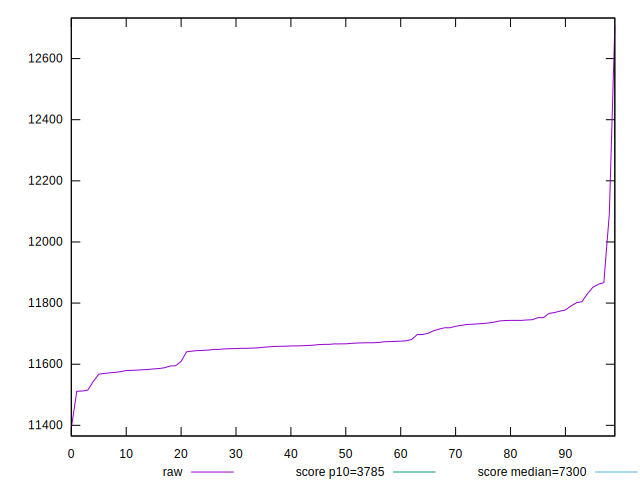
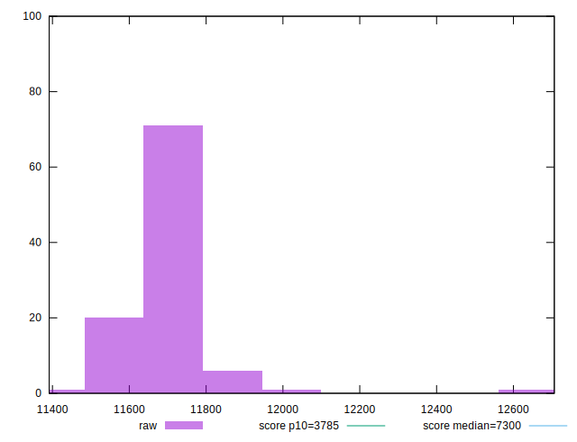
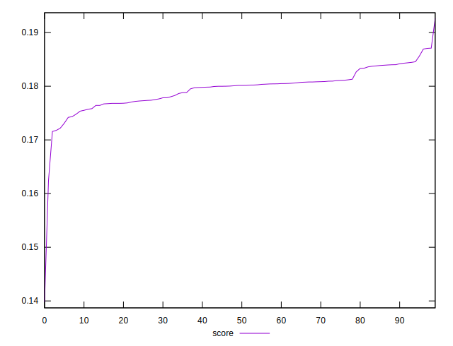

# //interactive/samples/pages

[→ Parent](../..)


## Raw


```yaml
p90min: 11543.668000000001
p90max: 11830.229000000001
p90range: 286.5609999999997
p90mean: 11675.076181318682
p90median: 11666.527999999998
p90stdev: 62.484186377128005
p90skewness: 0.1006391124454889
p90eccentricity: 1.0000000000000007
p90discretization: 1
outlandishness: 1.0021128473150027

```


## Score


```yaml
p90min: 0.17310418764570634
p90max: 0.18562725198955632
p90range: 0.012523064343849977
p90mean: 0.17979848652801228
p90median: 0.18015301663295402
p90stdev: 0.0027362082560627382
p90skewness: -0.06645069943195626
p90eccentricity: 1.0000000000000002
p90discretization: 1
outlandishness: 0.9948053648419033

```

