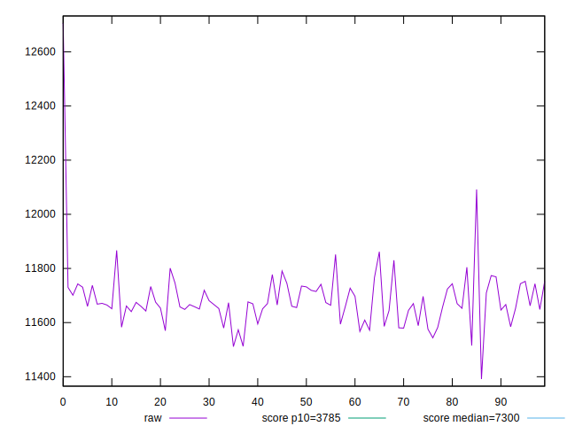
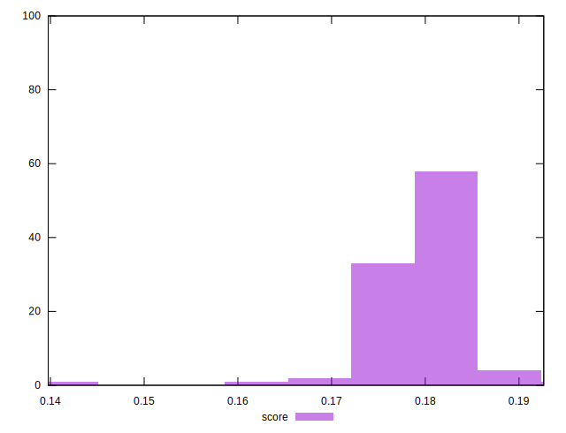

# //interactive/samples/pages

[→ Parent](../..)


## Raw


```yaml
p90min: 11391.3985
p90max: 11773.609
p90range: 382.21050000000105
p90mean: 11659.536761111109
p90median: 11663.0585
p90stdev: 67.70336817172212
p90skewness: -0.8716124714660988
p90eccentricity: 0.9999999999999999
p90discretization: 1
outlandishness: 1.004785788791873

```


## Score


```yaml
p90min: 0.13976444748412886
p90max: 0.18401407216533117
p90range: 0.044249624681202304
p90mean: 0.17857672755794604
p90median: 0.1799932193477656
p90stdev: 0.005274483394563484
p90skewness: -4.725342705610858
p90eccentricity: 1.0000000000000002
p90discretization: 1
outlandishness: 1.0084641445272116

```

