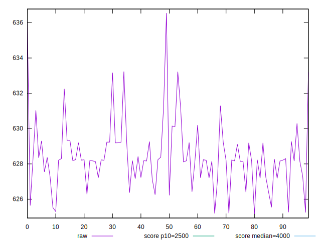
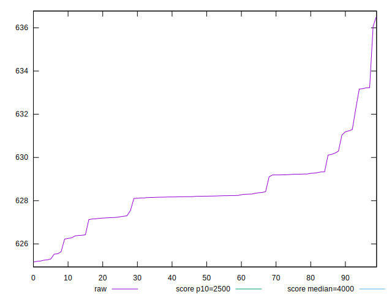
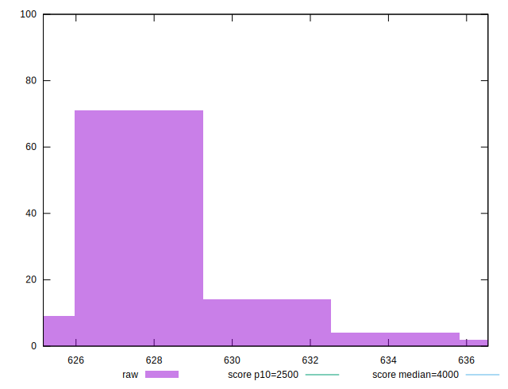
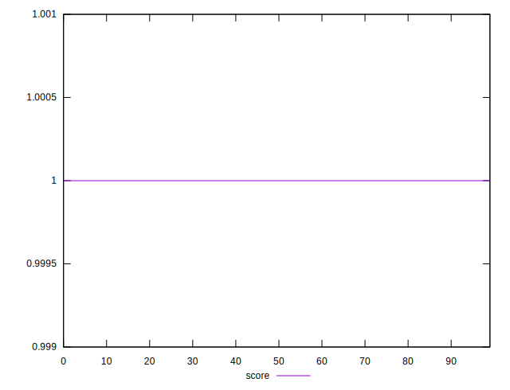
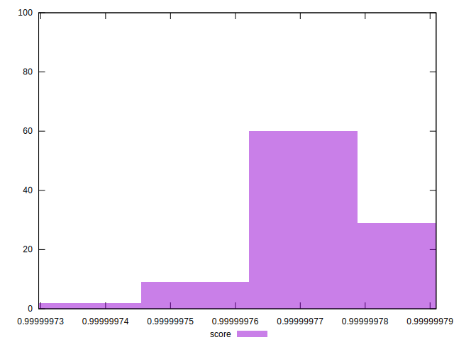

# //largest-contentful-paint/samples/empty

[→ Parent](../..)


## Raw


```yaml
p90min: 625.20675
p90max: 631.29395
p90range: 6.087199999999939
p90mean: 628.121121978022
p90median: 628.20435
p90stdev: 1.3320611023920694
p90skewness: -0.08782431916081142
p90eccentricity: 1
p90discretization: 1
outlandishness: 1.0011125661661102

```


## Score


```yaml
p90min: 0.9999997597054378
p90max: 0.9999997907205245
p90range: 3.101508672109787e-8
p90mean: 0.9999997762577918
p90median: 0.9999997759262111
p90stdev: 6.7611830946677495e-9
p90skewness: -0.00429263430343963
p90eccentricity: 0.9999999999999986
p90discretization: 1
outlandishness: 0.9999999961774302

```

