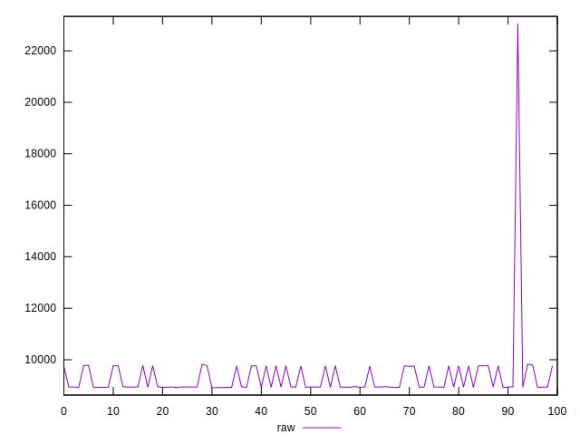
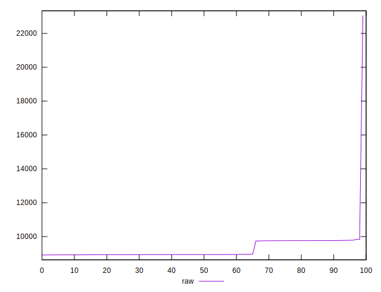
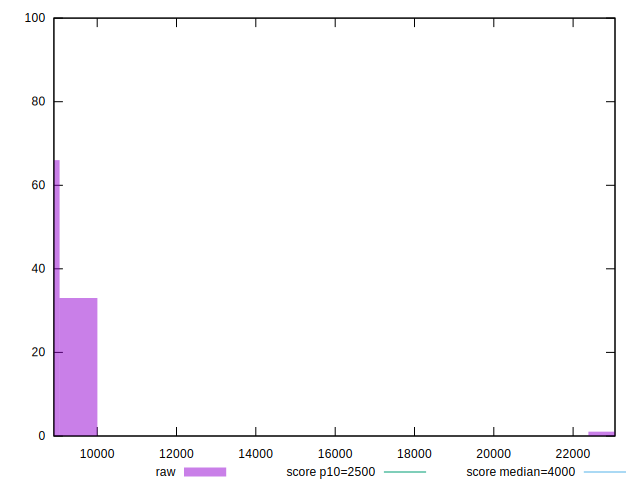
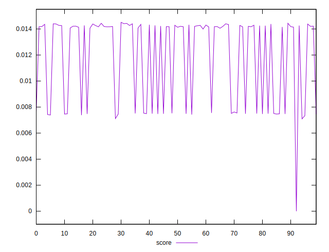
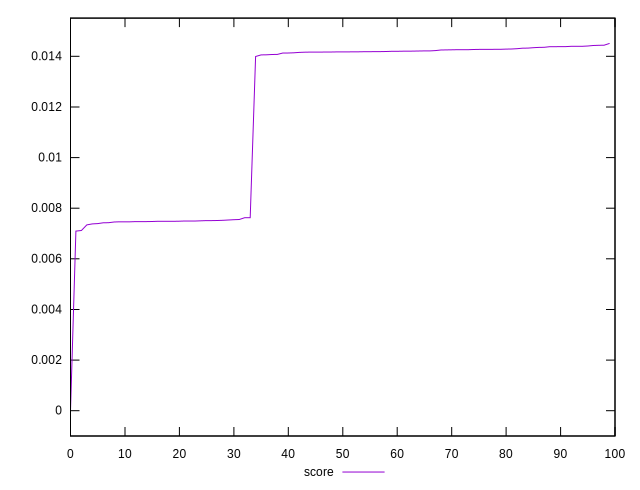
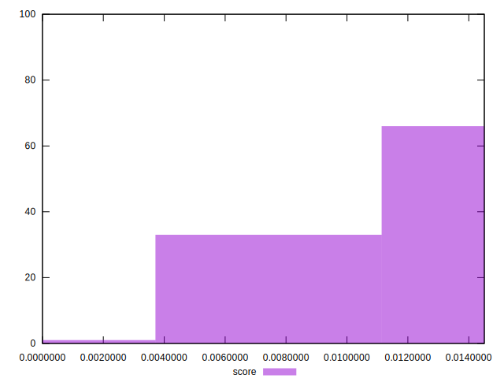

# //largest-contentful-paint/samples/pages+cached+noadtech

[→ Parent](../..)


## Raw


```yaml
p90min: 8908.24545
p90max: 9767.281500000001
p90range: 859.0360500000006
p90mean: 9152.662107222222
p90median: 8937.715050000003
p90stdev: 366.051220626831
p90skewness: 1.0539705801129364
p90eccentricity: 0.9999999999999993
p90discretization: 1
outlandishness: 1.043340741436516

```


## Score


```yaml
p90min: 8.945789222170042e-7
p90max: 0.014380438967616926
p90range: 0.01437954438869471
p90mean: 0.01158086303101238
p90median: 0.014166737146857233
p90stdev: 0.003469146032578743
p90skewness: -0.7550220071268684
p90eccentricity: 0.9999999999999999
p90discretization: 1
outlandishness: 1.0495890848263725

```

