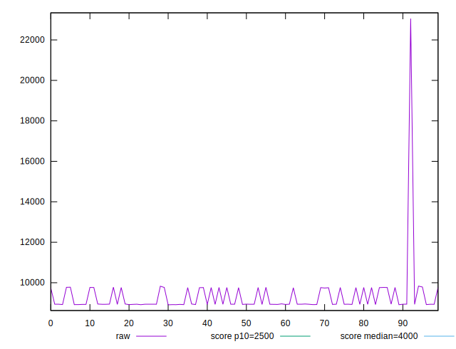
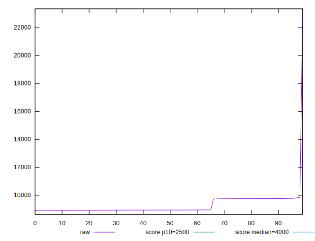
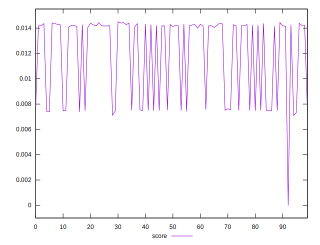

# //largest-contentful-paint/samples/pages+cached+noadtech

[→ Parent](../..)


## Raw


```yaml
p90min: 8917.363350000001
p90max: 9779.661
p90range: 862.2976499999986
p90mean: 9197.245468131869
p90median: 8938.319550000004
p90stdev: 386.17520166674524
p90skewness: 0.7776917292748032
p90eccentricity: 0.9999999999999997
p90discretization: 1
outlandishness: 1.0332501343220892

```


## Score


```yaml
p90min: 0.007461580911932386
p90max: 0.014510134842865341
p90range: 0.007048553930932955
p90mean: 0.012393688084655593
p90median: 0.014181591122720993
p90stdev: 0.003010235226059681
p90skewness: -1.0065408411560361
p90eccentricity: 1
p90discretization: 1
outlandishness: 0.9164315496331079

```


## P Score


```yaml
p90min: 0.007461580911932386
p90max: 0.014510134842865341
p90range: 0.007048553930932955
p90mean: 0.012393688084655593
p90median: 0.014181591122720993
p90stdev: 0.003010235226059681
p90skewness: -1.0065408411560361
p90eccentricity: 1
p90discretization: 1
outlandishness: 0.9164315496331079

```


## Score Difference


```yaml
p90min: -0.004510134842865341
p90max: 0.002538257942433333
p90range: 0.007048392785298674
p90mean: -0.002421592630446685
p90median: -0.004181591122720993
p90stdev: 0.002975960252781871
p90skewness: 1.0255400363429001
p90eccentricity: 1.0000000000000002
p90discretization: 1
outlandishness: 0.6581359752573583

```


## P Score Difference


```yaml
p90min: 0
p90max: 0
p90range: 0
p90mean: 0
p90median: 0
p90stdev: 0
p90skewness: .nan
p90eccentricity: .nan
p90discretization: 91
outlandishness: .nan

```

