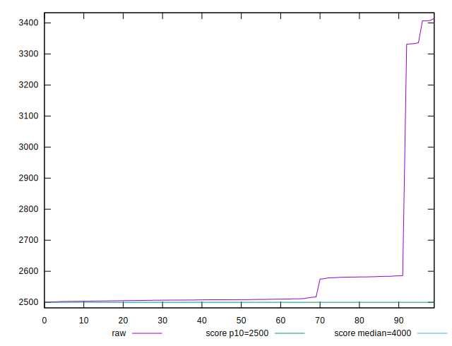
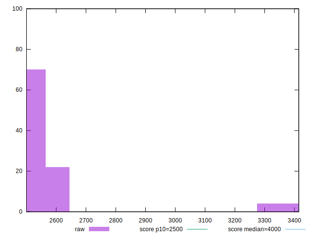
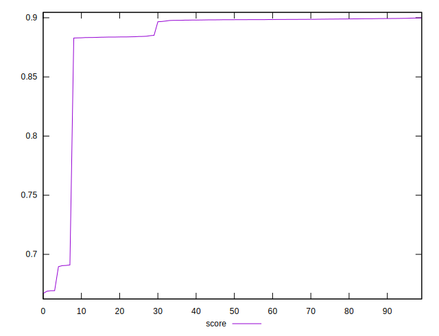

# //largest-contentful-paint/samples/pages+cached+noexternal+nocss

[→ Parent](../..)


## Raw


```yaml
p90min: 2500.3651
p90max: 2584.8756999999996
p90range: 84.51059999999961
p90mean: 2523.5206311111115
p90median: 2508.190375
p90stdev: 30.95366565299263
p90skewness: 1.310287004683833
p90eccentricity: 0.9999999999999999
p90discretization: 1
outlandishness: 1.0554718626820978

```


## Score


```yaml
p90min: 0.6669467082670449
p90max: 0.899337273678978
p90range: 0.23239056541193304
p90mean: 0.8754254669387126
p90median: 0.8982495228546556
p90stdev: 0.06159486712791936
p90skewness: -2.8510391333131735
p90eccentricity: 1
p90discretization: 1
outlandishness: 1.0055256575631284

```

