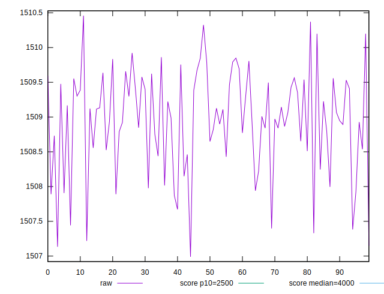
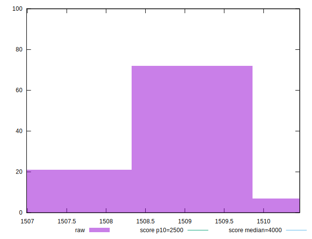
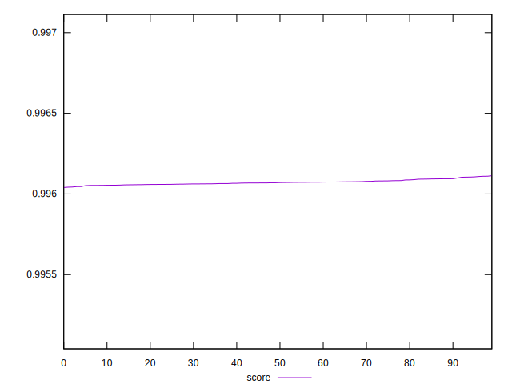

# //largest-contentful-paint/samples/pages+cached+noexternal+nofonts+nosvg+noimg+nocss+nojs

[→ Parent](../..)


## Raw


```yaml
p90min: 1506.9898000000003
p90max: 1509.8064
p90range: 2.816599999999653
p90mean: 1508.8097111111108
p90median: 1508.9313000000002
p90stdev: 0.7209482398502735
p90skewness: -0.786516901767955
p90eccentricity: 0.9999999999999999
p90discretization: 1.0112359550561798
outlandishness: 1.0001692331233056

```


## Score


```yaml
p90min: 0.9960400057423351
p90max: 0.9960941737562043
p90range: 0.00005416801386926018
p90mean: 0.9960684420856166
p90median: 0.9960682073172572
p90stdev: 0.000012892903779991624
p90skewness: 0.16468159834579105
p90eccentricity: 1
p90discretization: 1.0112359550561798
outlandishness: 1.0000073991245195

```

