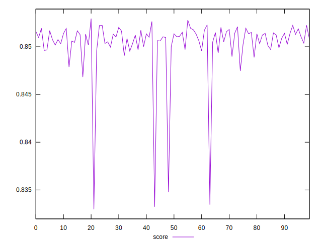
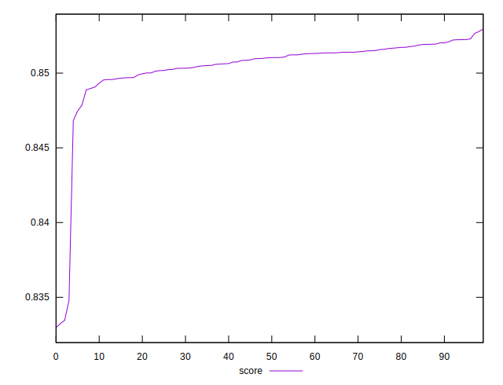

# //largest-contentful-paint/samples/pages+cached+noexternal+nofonts+nosvg+noimg+nocss

[→ Parent](../..)


## Raw


```yaml
p90min: 2722.4326
p90max: 2738.0352000000003
p90range: 15.602600000000166
p90mean: 2730.6258555555555
p90median: 2729.9119499999997
p90stdev: 3.5602893150577257
p90skewness: 0.10265998537916296
p90eccentricity: 1.0000000000000007
p90discretization: 1
outlandishness: 1.002697087197923

```


## Score


```yaml
p90min: 0.8329705764374848
p90max: 0.8520226125629231
p90range: 0.019052036125438265
p90mean: 0.8499361687731221
p90median: 0.8508699746602462
p90stdev: 0.003656503962427728
p90skewness: -3.948500955856389
p90eccentricity: 0.9999999999999999
p90discretization: 1
outlandishness: 1.0005726685615288

```

