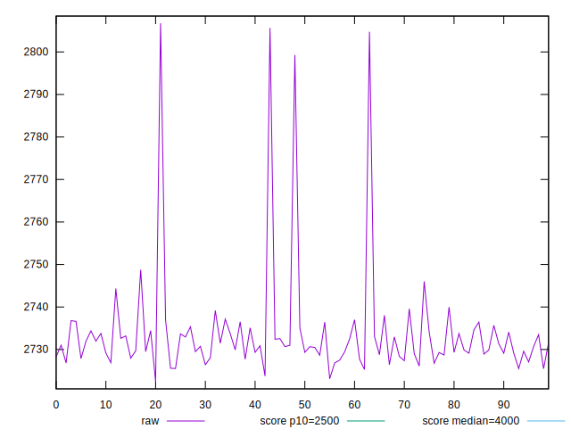
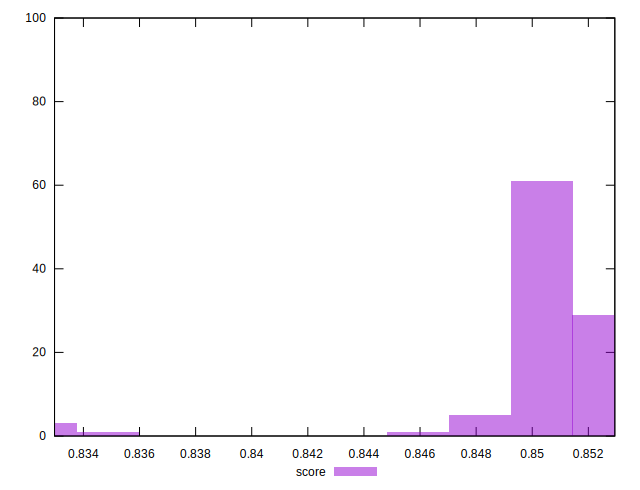

# //largest-contentful-paint/samples/pages+cached+noexternal+nofonts+nosvg+noimg+nocss

[→ Parent](../..)


## Raw


```yaml
p90min: 2725.2951000000003
p90max: 2744.3554000000013
p90range: 19.060300000001007
p90mean: 2731.3196593406606
p90median: 2730.6856000000007
p90stdev: 3.8585237843922737
p90skewness: 0.6899490196692374
p90eccentricity: 1.0000000000000002
p90discretization: 1
outlandishness: 1.0021877460996629

```


## Score


```yaml
p90min: 0.8478540793530458
p90max: 0.8522833735947075
p90range: 0.004429294241661719
p90mean: 0.8508883119375751
p90median: 0.8510364405345197
p90stdev: 0.0008953590899930143
p90skewness: -0.6967329772458877
p90eccentricity: 0.9999999999999999
p90discretization: 1
outlandishness: 0.9983346418196971

```


## P Score


```yaml
p90min: 0.8478540793530458
p90max: 0.8522833735947075
p90range: 0.004429294241661719
p90mean: 0.8508883119375751
p90median: 0.8510364405345197
p90stdev: 0.0008953590899930143
p90skewness: -0.6967329772458877
p90eccentricity: 0.9999999999999999
p90discretization: 1
outlandishness: 0.9983346418196971

```


## Score Difference


```yaml
p90min: -0.00294367600472778
p90max: 0.0009341572307582924
p90range: 0.0038778332354860723
p90mean: -0.0010275007315246618
p90median: -0.0012119865189930135
p90stdev: 0.0008462391280374616
p90skewness: 0.16276013024200747
p90eccentricity: 0.9999999999999996
p90discretization: 1
outlandishness: 0.9087500048847099

```


## P Score Difference


```yaml
p90min: 0
p90max: 0
p90range: 0
p90mean: 0
p90median: 0
p90stdev: 0
p90skewness: .nan
p90eccentricity: .nan
p90discretization: 91
outlandishness: .nan

```

