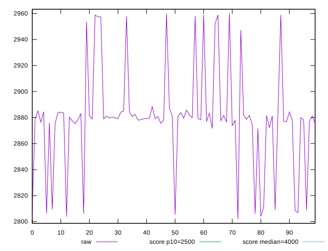
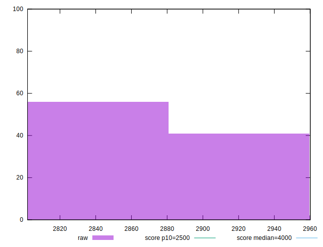
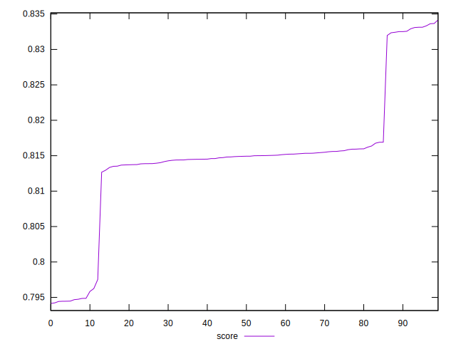

# //largest-contentful-paint/samples/pages+cached+noexternal+nofonts+nosvg+noimg

[→ Parent](../..)


## Raw


```yaml
p90min: 2801.8191000000006
p90max: 2953.6754999999985
p90range: 151.85639999999785
p90mean: 2870.8404505555554
p90median: 2879.153825
p90stdev: 30.473224063895152
p90skewness: -0.8109516590029778
p90eccentricity: 1.0000000000000002
p90discretization: 1
outlandishness: 1.0061276590137476

```


## Score


```yaml
p90min: 0.7941437714502708
p90max: 0.8325152284926367
p90range: 0.038371457042365886
p90mean: 0.8127531781169618
p90median: 0.8147737294408424
p90stdev: 0.008176784288838867
p90skewness: -0.8616590763941844
p90eccentricity: 1
p90discretization: 1
outlandishness: 1.005041624925361

```

