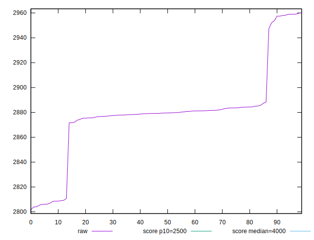
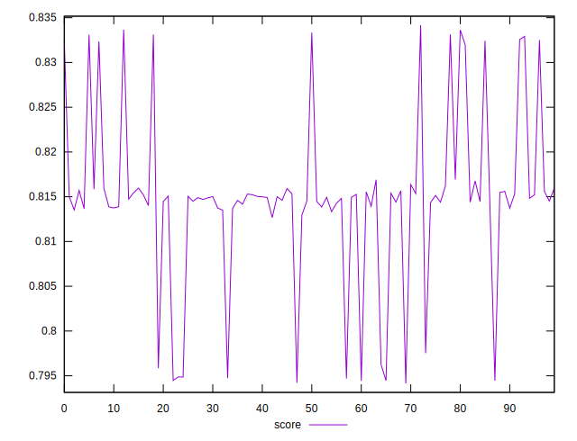

# //largest-contentful-paint/samples/pages+cached+noexternal+nofonts+nosvg+noimg

[→ Parent](../..)


## Raw


```yaml
p90min: 2803.9116000000004
p90max: 2957.423499999999
p90range: 153.5118999999986
p90mean: 2873.501650549449
p90median: 2879.195599999999
p90stdev: 31.99540593494466
p90skewness: -0.3973106657101635
p90eccentricity: 0.9999999999999997
p90discretization: 1
outlandishness: 1.0042649372181403

```


## Score


```yaml
p90min: 0.7948625677047677
p90max: 0.8341683683791558
p90range: 0.03930580067438805
p90mean: 0.8168074330274743
p90median: 0.8150090015817366
p90stdev: 0.007921737067429966
p90skewness: 0.5017014073999874
p90eccentricity: 0.9999999999999997
p90discretization: 1
outlandishness: 0.9950892608142277

```

