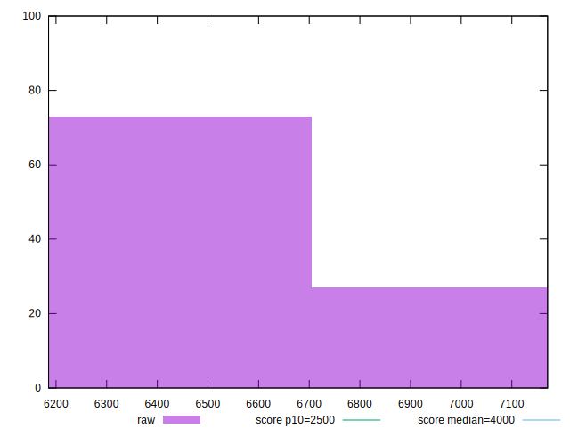
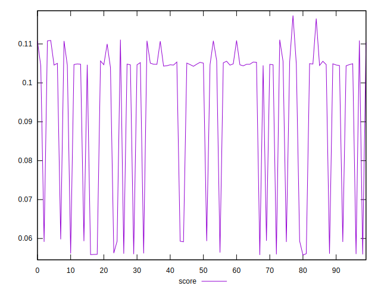

# //largest-contentful-paint/samples/pages+cached+noexternal+nofonts

[→ Parent](../..)


## Raw


```yaml
p90min: 6185.3243
p90max: 7162.5551000000005
p90range: 977.2308000000003
p90mean: 6469.776620555554
p90median: 6337.630599999999
p90stdev: 313.2725809048253
p90skewness: 1.5551406954027718
p90eccentricity: 0.9999999999999999
p90discretization: 1
outlandishness: 1.0216624902583131

```


## Score


```yaml
p90min: 0.05574573939475902
p90max: 0.11077388674487304
p90range: 0.05502814735011402
p90mean: 0.09090548714635646
p90median: 0.10464959283118858
p90stdev: 0.02202512352671908
p90skewness: -0.8655856035338176
p90eccentricity: 0.9999999999999993
p90discretization: 1
outlandishness: 1.0472094780323946

```

