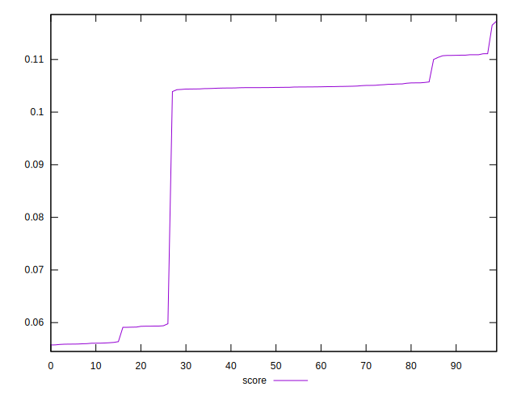
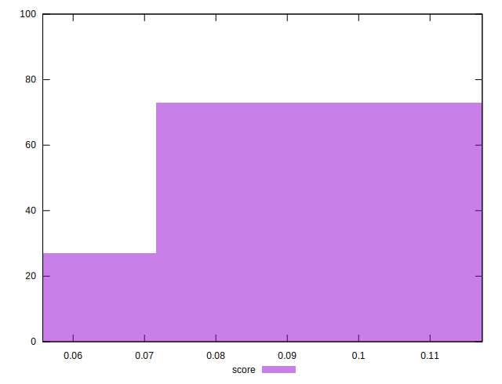

# //largest-contentful-paint/samples/pages+cached+noexternal+nofonts

[→ Parent](../..)


## Raw


```yaml
p90min: 6185.3243
p90max: 7162.8123
p90range: 977.4879999999994
p90mean: 6477.392397252748
p90median: 6337.680049999998
p90stdev: 319.81440949219416
p90skewness: 1.485956010500206
p90eccentricity: 0.9999999999999999
p90discretization: 1
outlandishness: 1.0192614687333341

```


## Score


```yaml
p90min: 0.05607660686804594
p90max: 0.11731416104583847
p90range: 0.06123755417779253
p90mean: 0.09669964151427154
p90median: 0.10476297742285978
p90stdev: 0.019364920403177485
p90skewness: -1.4488183549226015
p90eccentricity: 1
p90discretization: 1
outlandishness: 0.925473596671273

```


## P Score


```yaml
p90min: 0.05607660686804594
p90max: 0.11731416104583847
p90range: 0.06123755417779253
p90mean: 0.09669964151427154
p90median: 0.10476297742285978
p90stdev: 0.019364920403177485
p90skewness: -1.4488183549226015
p90eccentricity: 1
p90discretization: 1
outlandishness: 0.925473596671273

```


## Score Difference


```yaml
p90min: -0.004949793694665833
p90max: 0.004644412422563096
p90range: 0.009594206117228929
p90mean: -0.001055776950680514
p90median: -0.0008994673432105443
p90stdev: 0.0036800234367244974
p90skewness: 0.327132719883508
p90eccentricity: 1.0000000000000004
p90discretization: 1
outlandishness: 0.2487268945020934

```


## P Score Difference


```yaml
p90min: 0
p90max: 0
p90range: 0
p90mean: 0
p90median: 0
p90stdev: 0
p90skewness: .nan
p90eccentricity: .nan
p90discretization: 91
outlandishness: .nan

```

