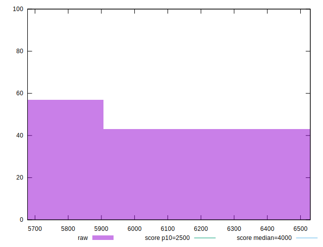
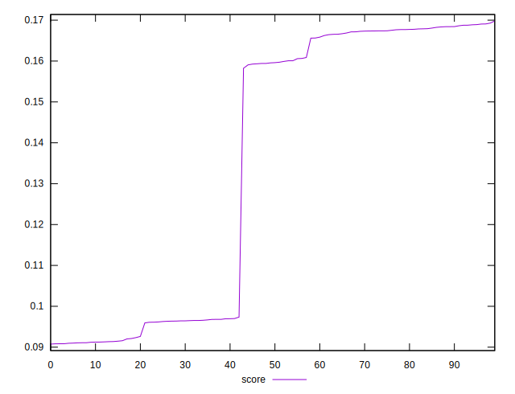

# //largest-contentful-paint/samples/pages+cached+noexternal+noimg

[→ Parent](../..)


## Raw


```yaml
p90min: 5677.471
p90max: 6522.731600000001
p90range: 845.2606000000014
p90mean: 5996.295153296704
p90median: 5759.7661
p90stdev: 368.3210591942331
p90skewness: 0.5189942799244647
p90eccentricity: 0.9999999999999999
p90discretization: 1
outlandishness: 1.0159855567086578

```


## Score


```yaml
p90min: 0.09120926787657757
p90max: 0.16981000368034238
p90range: 0.07860073580376481
p90mean: 0.1391500057653598
p90median: 0.16007347908331304
p90stdev: 0.03438686267039375
p90skewness: -0.5071532005520933
p90eccentricity: 0.9999999999999996
p90discretization: 1
outlandishness: 0.9386058498820554

```

