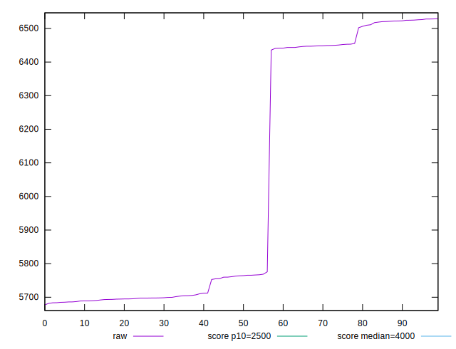
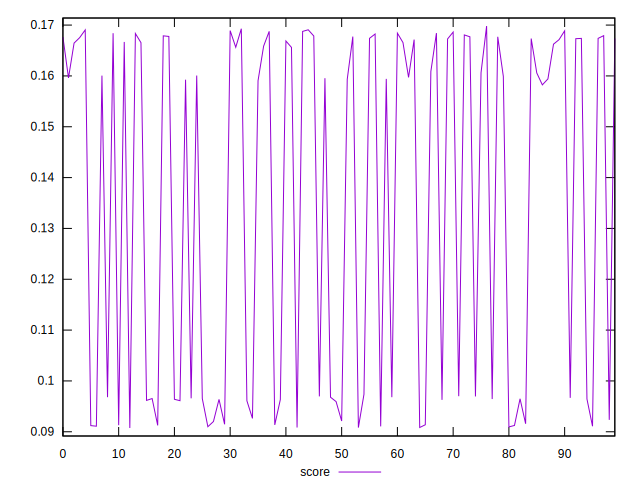

# //largest-contentful-paint/samples/pages+cached+noexternal+noimg

[→ Parent](../..)


## Raw


```yaml
p90min: 5677.471
p90max: 6522.292600000001
p90range: 844.8216000000011
p90mean: 5990.445859444444
p90median: 5757.550724999999
p90stdev: 366.1341895306453
p90skewness: 0.5491242631471156
p90eccentricity: 0.9999999999999996
p90discretization: 1
outlandishness: 1.01797061745196

```


## Score


```yaml
p90min: 0.09074799393538618
p90max: 0.16841476537110645
p90range: 0.07766677143572026
p90mean: 0.13101668190939172
p90median: 0.15915782285197766
p90stdev: 0.03554083865857783
p90skewness: -0.08114678966000213
p90eccentricity: 0.9999999999999997
p90discretization: 1
outlandishness: 1.0587575520039605

```

