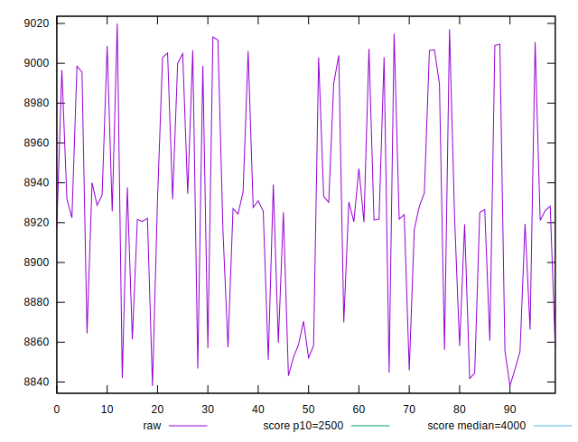
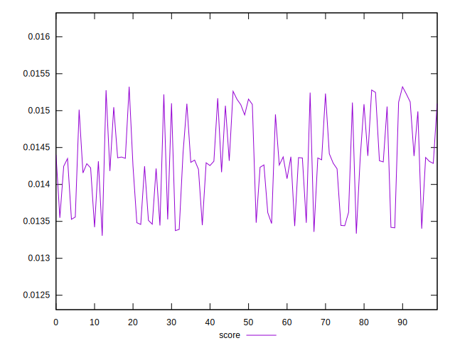
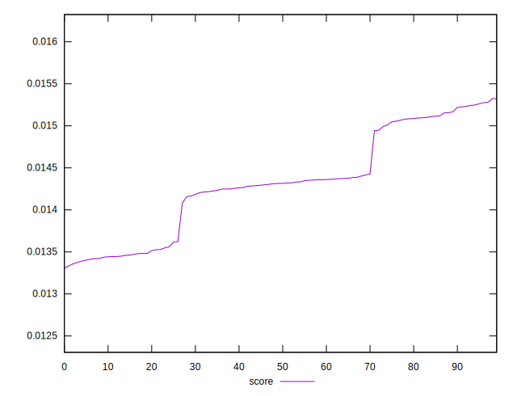

# //largest-contentful-paint/samples/pages+cached+noexternal+nosvg

[→ Parent](../..)


## Raw


```yaml
p90min: 8843.150350000004
p90max: 9010.641749999999
p90range: 167.49139999999534
p90mean: 8925.794006043954
p90median: 8925.6657
p90stdev: 53.19431050448313
p90skewness: 0.09954217446813954
p90eccentricity: 0.9999999999999997
p90discretization: 1
outlandishness: 1.000234069613781

```


## Score


```yaml
p90min: 0.013391228509462616
p90max: 0.015246426053601214
p90range: 0.0018551975441385982
p90mean: 0.014305491181508393
p90median: 0.014314611836237168
p90stdev: 0.000589943002828157
p90skewness: -0.022088843051255268
p90eccentricity: 0.9999999999999993
p90discretization: 1
outlandishness: 1.001519022770932

```


## P Score


```yaml
p90min: 0.013391228509462616
p90max: 0.015246426053601214
p90range: 0.0018551975441385982
p90mean: 0.014305491181508393
p90median: 0.014314611836237168
p90stdev: 0.000589943002828157
p90skewness: -0.022088843051255268
p90eccentricity: 0.9999999999999993
p90discretization: 1
outlandishness: 1.001519022770932

```


## Score Difference


```yaml
p90min: -0.004990240803122168
p90max: 0.004900712522851885
p90range: 0.009890953325974053
p90mean: -0.002373780456989267
p90median: -0.004155750327857097
p90stdev: 0.0034583269089882647
p90skewness: 1.554922056199458
p90eccentricity: 0.9999999999999999
p90discretization: 1
outlandishness: 0.5227953826598374

```


## P Score Difference


```yaml
p90min: 0
p90max: 0
p90range: 0
p90mean: 0
p90median: 0
p90stdev: 0
p90skewness: .nan
p90eccentricity: .nan
p90discretization: 91
outlandishness: .nan

```

