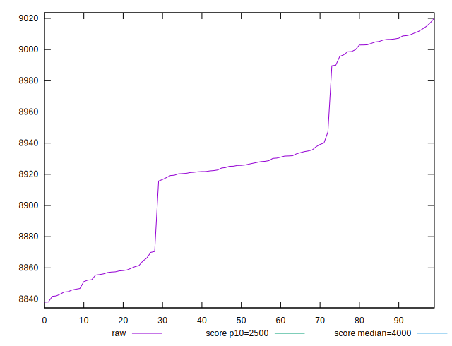

# //largest-contentful-paint/samples/pages+cached+noexternal+nosvg

[→ Parent](../..)


## Raw


```yaml
p90min: 8837.979899999998
p90max: 9006.803000000002
p90range: 168.82310000000325
p90mean: 8917.355080555559
p90median: 8923.39065
p90stdev: 52.27394279760491
p90skewness: 0.1731334110292662
p90eccentricity: 1.0000000000000004
p90discretization: 1
outlandishness: 1.0021281053956874

```


## Score


```yaml
p90min: 0.01330480788092775
p90max: 0.015167650651177644
p90range: 0.001862842770249895
p90mean: 0.014211181145815285
p90median: 0.014290634146468223
p90stdev: 0.000580004424268886
p90skewness: 0.03770492548620341
p90eccentricity: 1.0000000000000002
p90discretization: 1
outlandishness: 1.0148559446293344

```

