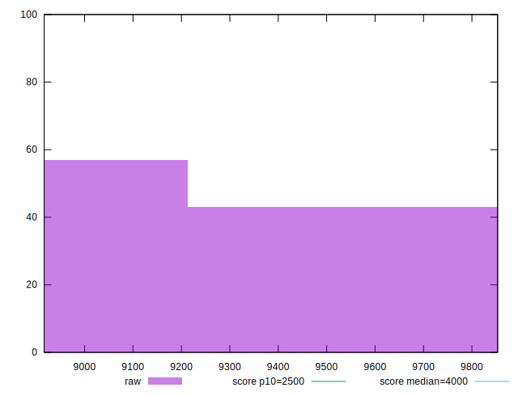
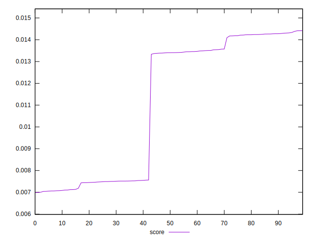

# //largest-contentful-paint/samples/pages+cached+noexternal

[→ Parent](../..)


## Raw


```yaml
p90min: 8916.46875
p90max: 9834.497000000001
p90range: 918.0282500000012
p90mean: 9263.401738333327
p90median: 9008.329275
p90stdev: 390.75875542645326
p90skewness: 0.5405541364983076
p90eccentricity: 0.9999999999999992
p90discretization: 1
outlandishness: 1.0125535497947895

```


## Score


```yaml
p90min: 0.006984183856467874
p90max: 0.014276903509610583
p90range: 0.00729271965314271
p90mean: 0.01069087518200409
p90median: 0.01337199896239269
p90stdev: 0.0032288628057838757
p90skewness: -0.07308582190264858
p90eccentricity: 1.0000000000000004
p90discretization: 1
outlandishness: 1.0695228372670913

```

