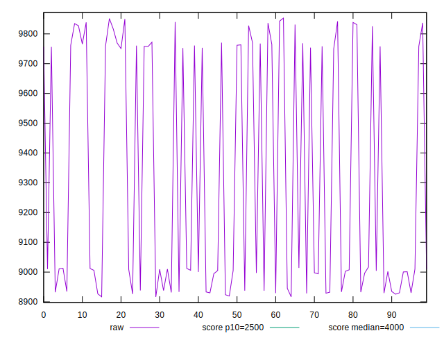
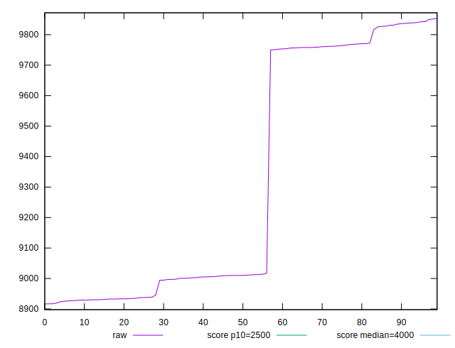
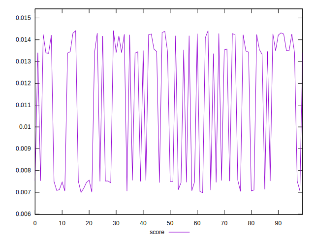

# //largest-contentful-paint/samples/pages+cached+noexternal

[→ Parent](../..)


## Raw


```yaml
p90min: 8916.46875
p90max: 9836.395400000003
p90range: 919.9266500000031
p90mean: 9269.698371978018
p90median: 9009.0215
p90stdev: 393.17012856976817
p90skewness: 0.5108030522257805
p90eccentricity: 1.0000000000000002
p90discretization: 1
outlandishness: 1.0111784212658252

```


## Score


```yaml
p90min: 0.0070745298808391754
p90max: 0.014417794319265542
p90range: 0.007343264438426367
p90mean: 0.01145401638576931
p90median: 0.013418382322516464
p90stdev: 0.0031422480184469977
p90skewness: -0.49259940590359
p90eccentricity: 0.9999999999999997
p90discretization: 1
outlandishness: 0.9317533877450579

```


## P Score


```yaml
p90min: 0.0070745298808391754
p90max: 0.014417794319265542
p90range: 0.007343264438426367
p90mean: 0.01145401638576931
p90median: 0.013418382322516464
p90stdev: 0.0031422480184469977
p90skewness: -0.49259940590359
p90eccentricity: 0.9999999999999997
p90discretization: 1
outlandishness: 0.9317533877450579

```


## Score Difference


```yaml
p90min: -0.004417794319265542
p90max: 0.0029254701191608248
p90range: 0.007343264438426367
p90mean: -0.0014540163857693117
p90median: -0.0034183823225164642
p90stdev: 0.0031422480184469977
p90skewness: 0.49259940590359313
p90eccentricity: 0.9999999999999993
p90discretization: 1
outlandishness: 0.5277206087493485

```


## P Score Difference


```yaml
p90min: 0
p90max: 0
p90range: 0
p90mean: 0
p90median: 0
p90stdev: 0
p90skewness: .nan
p90eccentricity: .nan
p90discretization: 91
outlandishness: .nan

```

