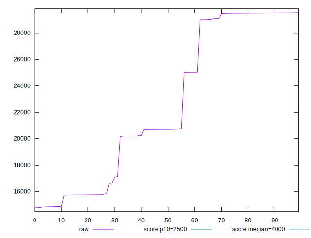
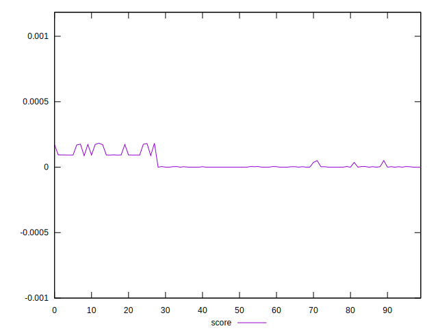
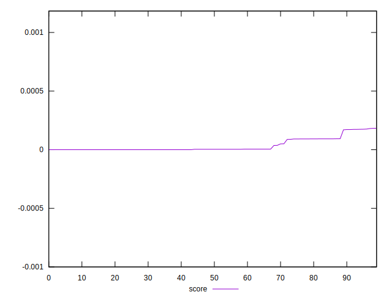

# //largest-contentful-paint/samples/pages+cached+nointeractive

[→ Parent](../..)


## Raw


```yaml
p90min: 14779.420749999997
p90max: 29515.06724999999
p90range: 14735.646499999992
p90mean: 21820.175436666665
p90median: 20718.089150000003
p90stdev: 5728.79072693067
p90skewness: 0.2476376971303402
p90eccentricity: 0.9999999999999999
p90discretization: 1.0112359550561798
outlandishness: 1.071849545411546

```


## Score


```yaml
p90min: 2.5091771993501766e-8
p90max: 0.00016982406286125684
p90range: 0.00016979897108926334
p90mean: 0.00002233121702681948
p90median: 0.0000035907587588035472
p90stdev: 0.00003886563752336883
p90skewness: 1.5851214885419944
p90eccentricity: 1.0000000000000004
p90discretization: 1.0112359550561798
outlandishness: 2.8535463816731985

```

