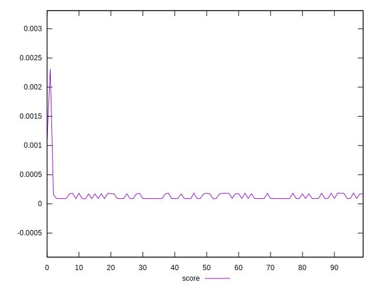
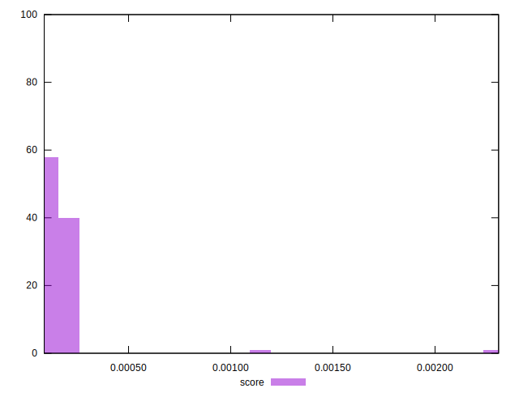

# //largest-contentful-paint/samples/pages+cached

[→ Parent](../..)


## Raw


```yaml
p90min: 14781.5129
p90max: 15844.007299999994
p90range: 1062.4943999999941
p90mean: 15434.950306593402
p90median: 15760.802200000002
p90stdev: 447.9746804005015
p90skewness: -0.5786337981697186
p90eccentricity: 1.0000000000000002
p90discretization: 1
outlandishness: 0.9846160621557554

```


## Score


```yaml
p90min: 0.00009058541282780386
p90max: 0.0001864052208437328
p90range: 0.00009581980801592893
p90mean: 0.00012923699830319734
p90median: 0.00009289123054062598
p90stdev: 0.00004218760339733752
p90skewness: 0.2689028854432235
p90eccentricity: 1.0000000000000004
p90discretization: 1
outlandishness: 1.4938108299570043

```

