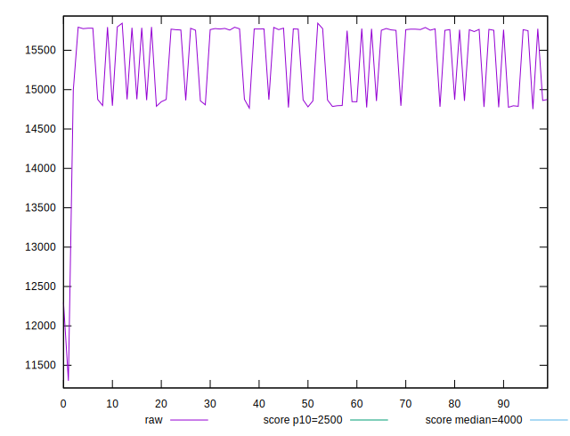
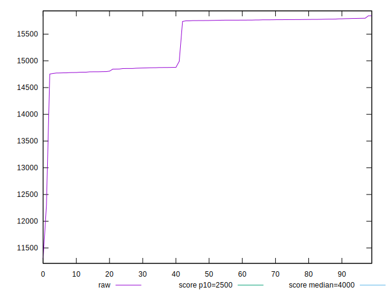
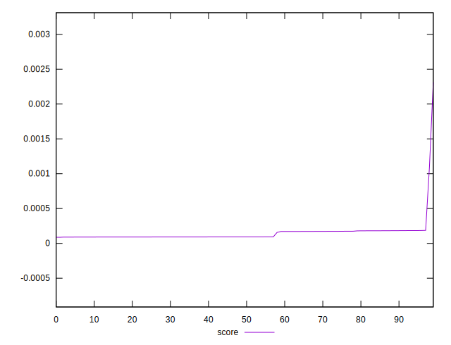

# //largest-contentful-paint/samples/pages+cached

[→ Parent](../..)


## Raw


```yaml
p90min: 11302.4264
p90max: 15785.658799999996
p90range: 4483.232399999995
p90mean: 15261.663476111115
p90median: 15750.6027
p90stdev: 700.8722350522177
p90skewness: -2.7523596293227928
p90eccentricity: 1.0000000000000002
p90discretization: 1
outlandishness: 1.0071024241854936

```


## Score


```yaml
p90min: 0.0000872974611407229
p90max: 0.0001826229911407462
p90range: 0.0000953255300000233
p90mean: 0.00012128614586126018
p90median: 0.00009242646748083838
p90stdev: 0.00003992732442780064
p90skewness: 0.6207724445973438
p90eccentricity: 1.0000000000000004
p90discretization: 1
outlandishness: 1.696082360043187

```

