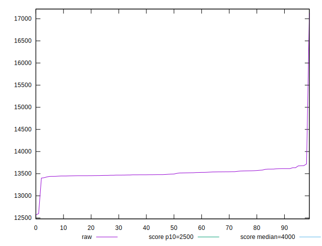
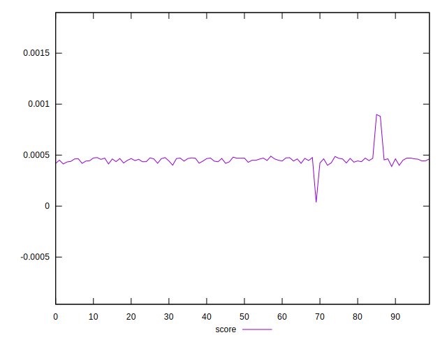

# //largest-contentful-paint/samples/pages

[→ Parent](../..)


## Raw


```yaml
p90min: 13426.594000000001
p90max: 13634.722499999996
p90range: 208.12849999999526
p90mean: 13510.508340659346
p90median: 13489.956999999999
p90stdev: 56.071027966295894
p90skewness: 0.5670960548219179
p90eccentricity: 1.0000000000000009
p90discretization: 1
outlandishness: 1.0033590449780947

```


## Score


```yaml
p90min: 0.00041919943963025785
p90max: 0.0004896445573458474
p90range: 0.00007044511771558959
p90mean: 0.00045402675241874445
p90median: 0.0004611275166585549
p90stdev: 0.000017879191670208218
p90skewness: -0.4084206088953806
p90eccentricity: 1.000000000000001
p90discretization: 1
outlandishness: 1.0063669366047117

```

