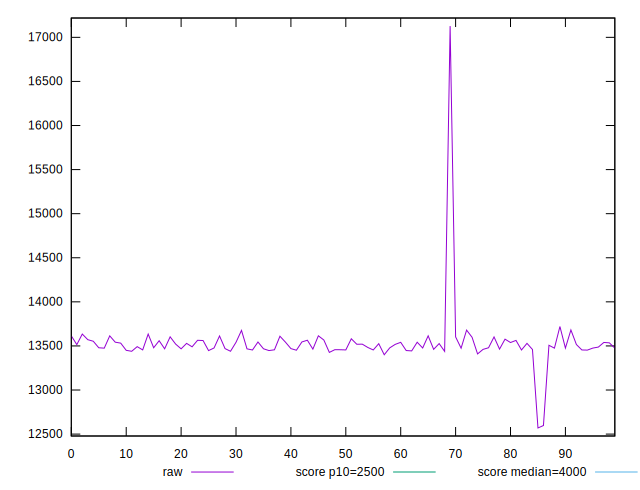
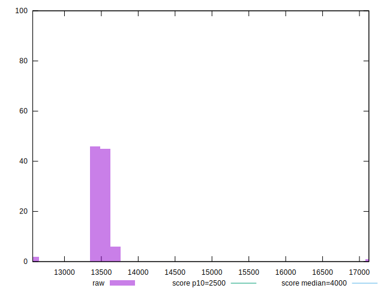
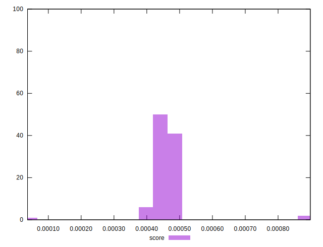

# //largest-contentful-paint/samples/pages

[→ Parent](../..)


## Raw


```yaml
p90min: 12569.567
p90max: 13614.254999999997
p90range: 1044.6879999999983
p90mean: 13481.32840555556
p90median: 13479.186749999997
p90stdev: 144.8239551271916
p90skewness: -5.220962679672715
p90eccentricity: 0.9999999999999996
p90discretization: 1
outlandishness: 1.0077072273775292

```


## Score


```yaml
p90min: 0.000036598970945544984
p90max: 0.0004731034182646199
p90range: 0.0004365044473190749
p90mean: 0.00044374527971737
p90median: 0.0004494698513402007
p90stdev: 0.00004771135972608006
p90skewness: -6.911375890805004
p90eccentricity: 0.9999999999999996
p90discretization: 1
outlandishness: 1.053541758143387

```

