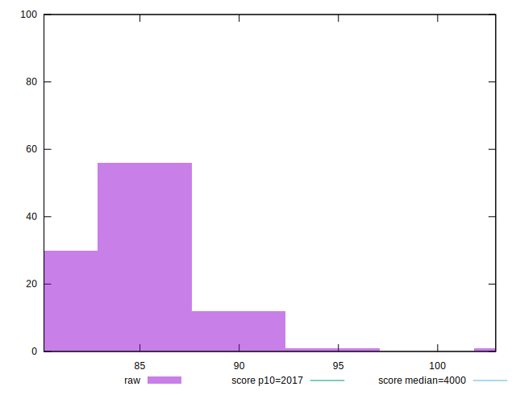
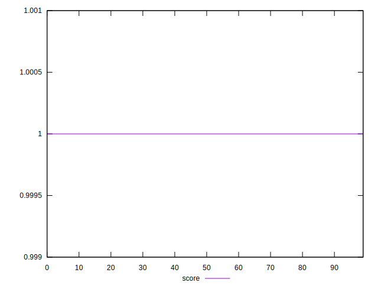
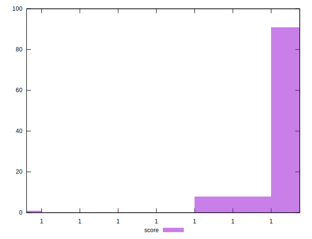

# //mainthread-work-breakdown/samples/empty

[→ Parent](../..)


## Raw


```yaml
p90min: 80.996
p90max: 88.872
p90range: 7.876000000000005
p90mean: 84.22905494505494
p90median: 84.13999999999999
p90stdev: 1.9198295560943863
p90skewness: 0.37408300745186956
p90eccentricity: 1.0000000000000002
p90discretization: 1.011111111111111
outlandishness: 1.0133734279483195

```


## Score


```yaml
p90min: 0.9999999999995115
p90max: 0.9999999999998737
p90range: 3.6215475063272606e-13
p90mean: 0.9999999999997417
p90median: 0.9999999999997566
p90stdev: 8.319151573372222e-14
p90skewness: -0.8341904224795778
p90eccentricity: 1
p90discretization: 1.0224719101123596
outlandishness: 0.9999999999998719

```

