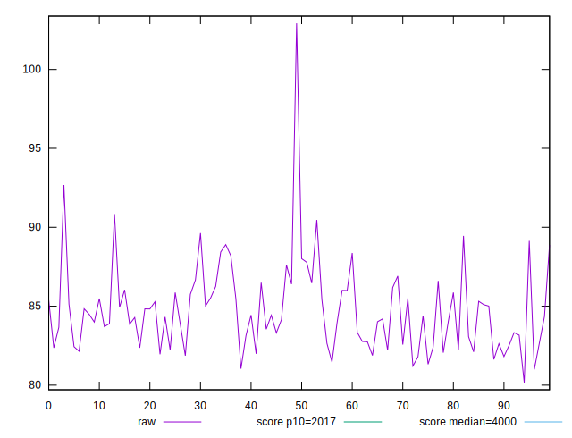

# //mainthread-work-breakdown/samples/empty

[→ Parent](../..)


## Raw


```yaml
p90min: 80.164
p90max: 88.37199999999999
p90range: 8.207999999999984
p90mean: 84.08555555555556
p90median: 84.03200000000001
p90stdev: 1.8583711572300858
p90skewness: 0.23066073548995675
p90eccentricity: 1
p90discretization: 1.0112359550561798
outlandishness: 1.0168352009480024

```


## Score


```yaml
p90min: 0.9999999999963033
p90max: 0.9999999999998304
p90range: 3.52706752693166e-12
p90mean: 0.999999999999659
p90median: 0.9999999999997312
p90stdev: 3.794670877551835e-13
p90skewness: -7.734309770956428
p90eccentricity: 0.9999991915584101
p90discretization: 1.0227272727272727
outlandishness: 1.0000000000000373

```

