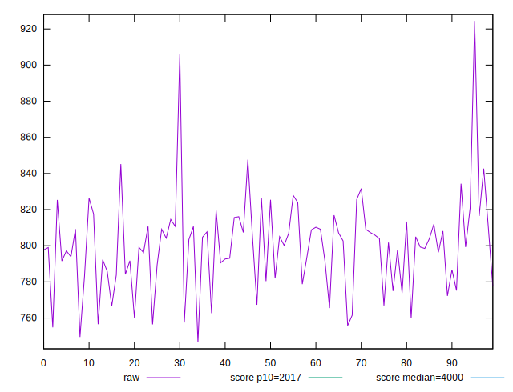
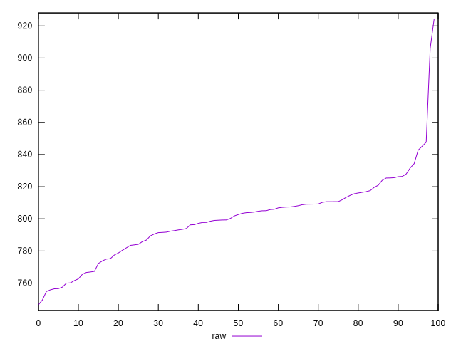
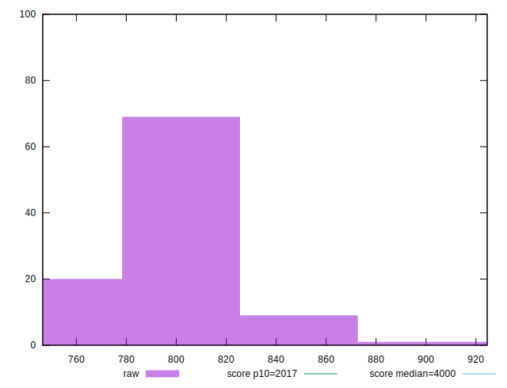
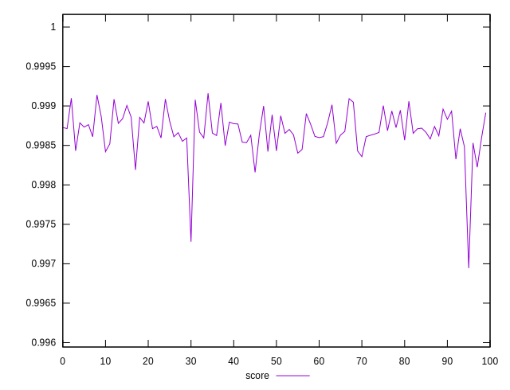
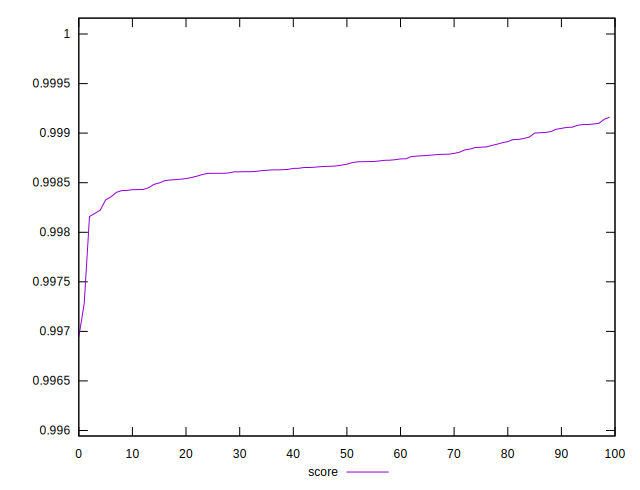
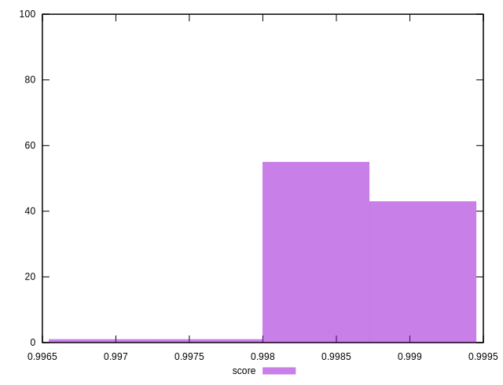

# //mainthread-work-breakdown/samples/pages+cached+noadtech

[→ Parent](../..)


## Raw


```yaml
p90min: 756.556
p90max: 842.6920000000006
p90range: 86.13600000000054
p90mean: 798.9691428571429
p90median: 802.6679999999997
p90stdev: 19.122770936145642
p90skewness: -0.3744087390427303
p90eccentricity: 1.0000000000000002
p90discretization: 1
outlandishness: 1.0023974655536623

```


## Score


```yaml
p90min: 0.998325618767735
p90max: 0.9990868989529618
p90range: 0.0007612801852268092
p90mean: 0.9987135219403234
p90median: 0.9986864659462075
p90stdev: 0.00018423683833826564
p90skewness: 0.25665481067996077
p90eccentricity: 0.9999999999999999
p90discretization: 1
outlandishness: 0.9999372108196435

```


## P Score


```yaml
p90min: 0.998325618767735
p90max: 0.9990868989529618
p90range: 0.0007612801852268092
p90mean: 0.9987135219403234
p90median: 0.9986864659462075
p90stdev: 0.00018423683833826564
p90skewness: 0.25665481067996077
p90eccentricity: 0.9999999999999999
p90discretization: 1
outlandishness: 0.9999372108196435

```


## Score Difference


```yaml
p90min: 0.0009131010470382339
p90max: 0.001674381232265043
p90range: 0.0007612801852268092
p90mean: 0.001286478059677102
p90median: 0.001313534053792531
p90stdev: 0.0001842368383382656
p90skewness: -0.25665481068760887
p90eccentricity: 1.0000000000000004
p90discretization: 1
outlandishness: 1.0493390305550008

```


## P Score Difference


```yaml
p90min: 0
p90max: 0
p90range: 0
p90mean: 0
p90median: 0
p90stdev: 0
p90skewness: .nan
p90eccentricity: .nan
p90discretization: 91
outlandishness: .nan

```

