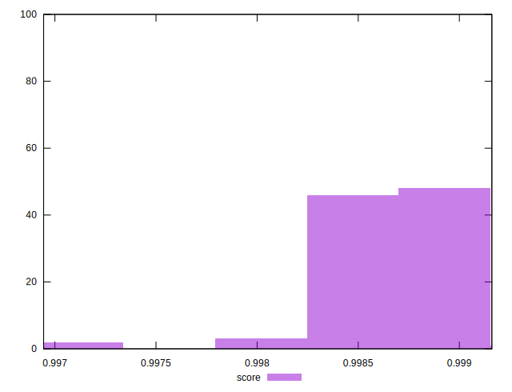

# //mainthread-work-breakdown/samples/pages+cached+noadtech

[→ Parent](../..)


## Raw


```yaml
p90min: 756.556
p90max: 842.6920000000006
p90range: 86.13600000000054
p90mean: 798.9691428571429
p90median: 802.6679999999997
p90stdev: 19.122770936145642
p90skewness: -0.3744087390427303
p90eccentricity: 1.0000000000000002
p90discretization: 1
outlandishness: 1.0023974655536623

```


## Score


```yaml
p90min: 0.998325618767735
p90max: 0.9990868989529618
p90range: 0.0007612801852268092
p90mean: 0.9987135219403234
p90median: 0.9986864659462075
p90stdev: 0.00018423683833826564
p90skewness: 0.25665481067996077
p90eccentricity: 0.9999999999999999
p90discretization: 1
outlandishness: 0.9999372108196435

```

