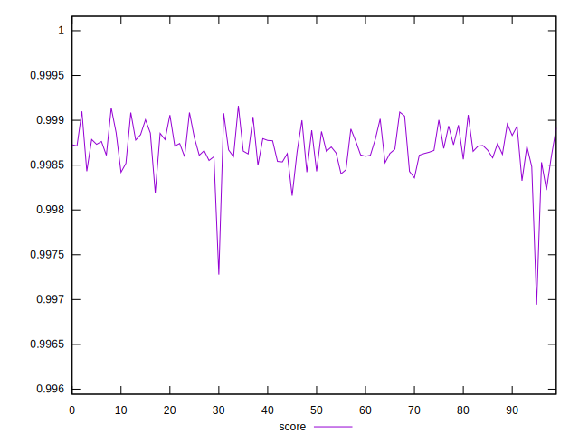
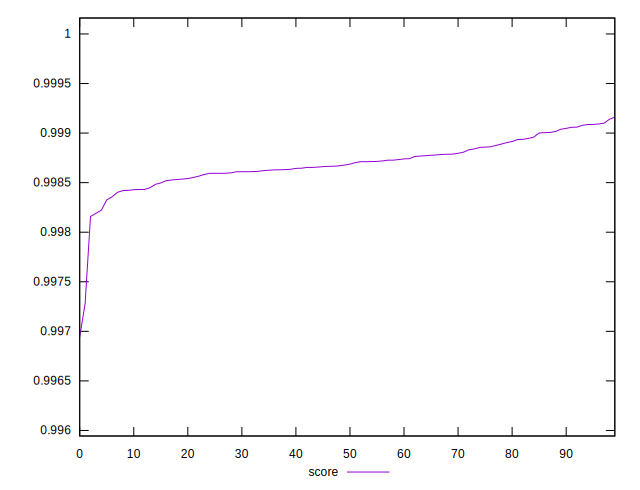

# //mainthread-work-breakdown/samples/pages+cached+noadtech

[→ Parent](../..)


## Raw


```yaml
p90min: 746.5239999999998
p90max: 825.6039999999998
p90range: 79.08000000000004
p90mean: 794.2239111111114
p90median: 799.0740000000003
p90stdev: 19.86160963805101
p90skewness: -0.6515571223882678
p90eccentricity: 1.0000000000000007
p90discretization: 1
outlandishness: 1.0144112511101204

```


## Score


```yaml
p90min: 0.9969441408137358
p90max: 0.9990383728719904
p90range: 0.0020942320582545415
p90mean: 0.9986367478982479
p90median: 0.9986591290492455
p90stdev: 0.0002945222648091764
p90skewness: -3.135854071059106
p90eccentricity: 0.9999999999999997
p90discretization: 1
outlandishness: 1.0000909647699614

```

