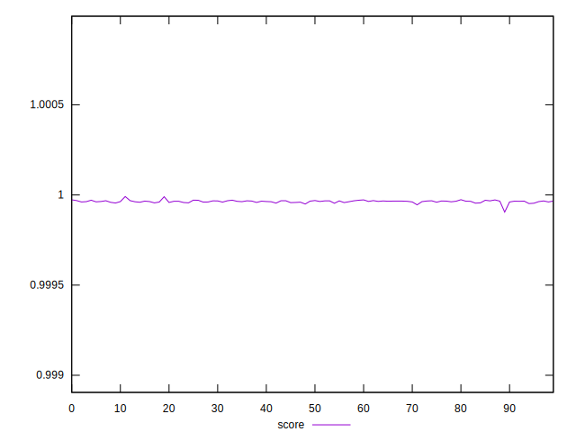
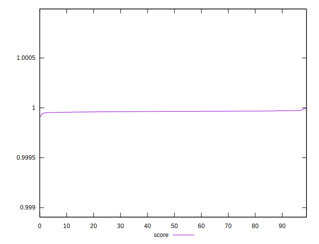

# //mainthread-work-breakdown/samples/pages+cached+noexternal+nocss

[→ Parent](../..)


## Raw


```yaml
p90min: 403.6120000000001
p90max: 492.01199999999994
p90range: 88.39999999999986
p90mean: 476.41431111111143
p90median: 477.25000000000017
p90stdev: 12.645930183830767
p90skewness: -3.7848305113001635
p90eccentricity: 1.0000000000000004
p90discretization: 1
outlandishness: 1.0104981647000868

```


## Score


```yaml
p90min: 0.9999050328384271
p90max: 0.9999705344423637
p90range: 0.00006550160393659077
p90mean: 0.9999623074308753
p90median: 0.9999640997886419
p90stdev: 0.000007719894699661758
p90skewness: -4.701444837528395
p90eccentricity: 1.0000000000000002
p90discretization: 1.0112359550561798
outlandishness: 1.0000026826741604

```

