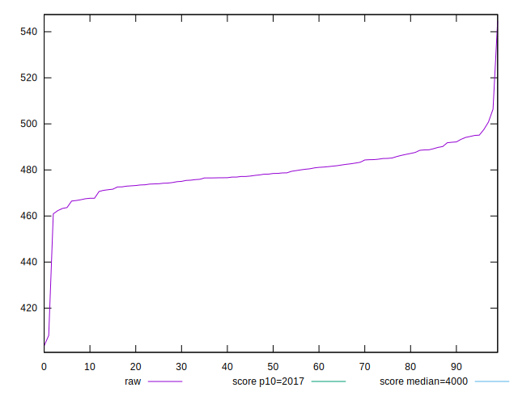

# //mainthread-work-breakdown/samples/pages+cached+noexternal+nocss

[→ Parent](../..)


## Raw


```yaml
p90min: 463.2760000000002
p90max: 494.9800000000003
p90range: 31.70400000000012
p90mean: 479.24505494505524
p90median: 478.1800000000001
p90stdev: 7.249297262437175
p90skewness: 0.16716692841989025
p90eccentricity: 1.0000000000000002
p90discretization: 1
outlandishness: 0.9985960552707601

```


## Score


```yaml
p90min: 0.9999543586940882
p90max: 0.9999731094844447
p90range: 0.00001875079035651428
p90mean: 0.9999642808652887
p90median: 0.9999649166091578
p90stdev: 0.000004271580797390335
p90skewness: -0.2991347161741328
p90eccentricity: 1.0000000000000007
p90discretization: 1.011111111111111
outlandishness: 0.9999987356576563

```

