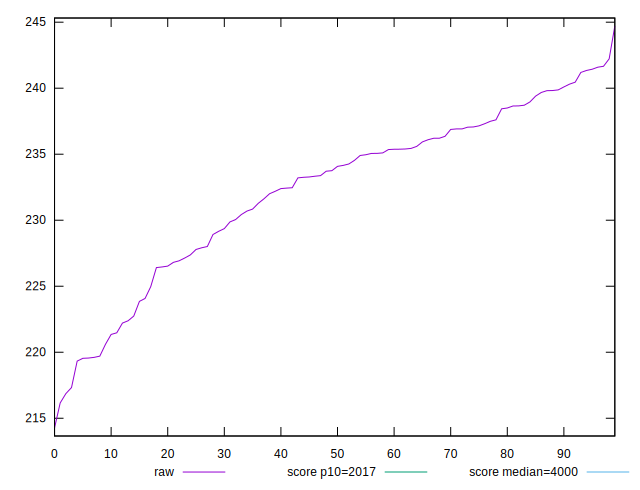

# //mainthread-work-breakdown/samples/pages+cached+noexternal+nofonts+nosvg+noimg+nocss+nojs

[→ Parent](../..)


## Raw


```yaml
p90min: 219.7039999999999
p90max: 242.224
p90range: 22.520000000000095
p90mean: 233.32931868131854
p90median: 234.53599999999997
p90stdev: 5.620307138138778
p90skewness: -0.593151199015558
p90eccentricity: 0.9999999999999999
p90discretization: 1.011111111111111
outlandishness: 0.990371363726543

```


## Score


```yaml
p90min: 0.999999925063425
p90max: 0.9999999720958161
p90range: 4.70323910928272e-8
p90mean: 0.9999999468279795
p90median: 0.9999999454608721
p90stdev: 1.2477777981117364e-8
p90skewness: 0.24646399160897042
p90eccentricity: 1.000000000000002
p90discretization: 1.011111111111111
outlandishness: 1.00000000277924

```

