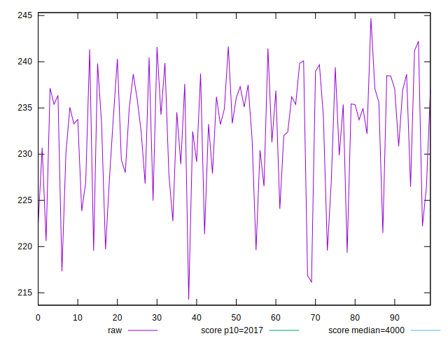
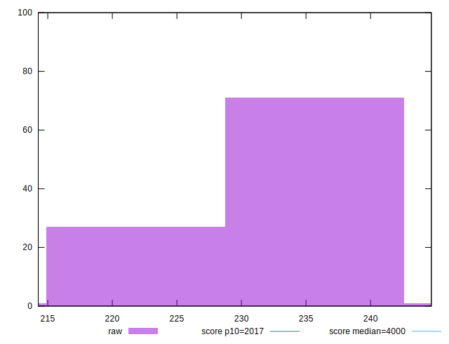
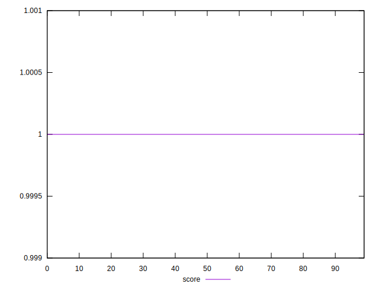
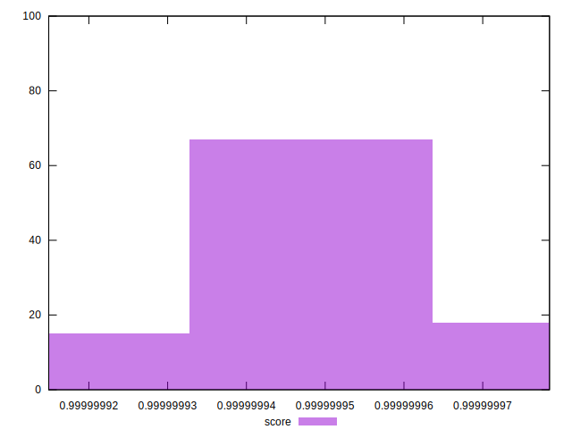

# //mainthread-work-breakdown/samples/pages+cached+noexternal+nofonts+nosvg+noimg+nocss+nojs

[→ Parent](../..)


## Raw


```yaml
p90min: 214.26399999999992
p90max: 239.87199999999996
p90range: 25.608000000000033
p90mean: 231.1700888888888
p90median: 233.26399999999995
p90stdev: 6.540875625453706
p90skewness: -0.7639388203472777
p90eccentricity: 0.9999999999999993
p90discretization: 1.0112359550561798
outlandishness: 1.008958771328784

```


## Score


```yaml
p90min: 0.9999999149055687
p90max: 0.9999999696967661
p90range: 5.4791197356962584e-8
p90mean: 0.9999999453855409
p90median: 0.9999999438334988
p90stdev: 1.2343257672699224e-8
p90skewness: 0.06999187617739933
p90eccentricity: 0.9999999999999974
p90discretization: 1.0112359550561798
outlandishness: 1.0000000056641176

```

