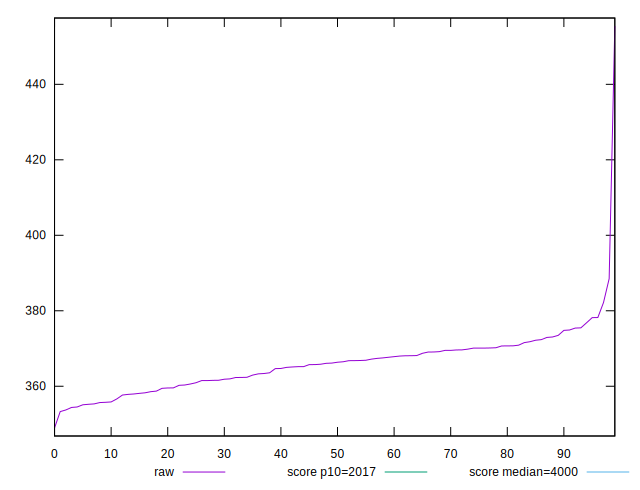
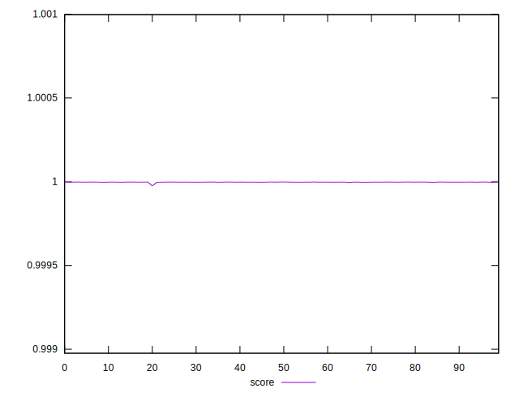
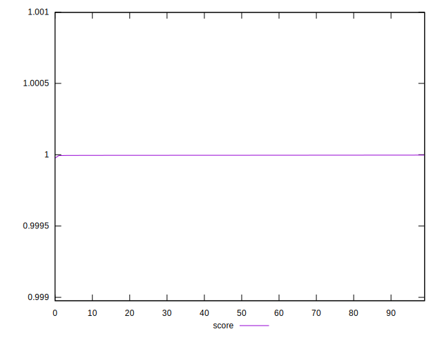

# //mainthread-work-breakdown/samples/pages+cached+noexternal+nofonts+nosvg+noimg+nocss

[→ Parent](../..)


## Raw


```yaml
p90min: 348.948
p90max: 373.4839999999999
p90range: 24.535999999999945
p90mean: 364.2994666666668
p90median: 365.4620000000001
p90stdev: 5.612184908650896
p90skewness: -0.4593485926311402
p90eccentricity: 1.0000000000000002
p90discretization: 1
outlandishness: 1.0119448545816483

```


## Score


```yaml
p90min: 0.9999761645434592
p90max: 0.9999970310783821
p90range: 0.000020866534922947544
p90mean: 0.9999958634462661
p90median: 0.9999961173840495
p90stdev: 0.0000021649808878155003
p90skewness: -8.368288051499004
p90eccentricity: 1.0000000000000009
p90discretization: 1.0344827586206897
outlandishness: 1.0000002570073603

```

