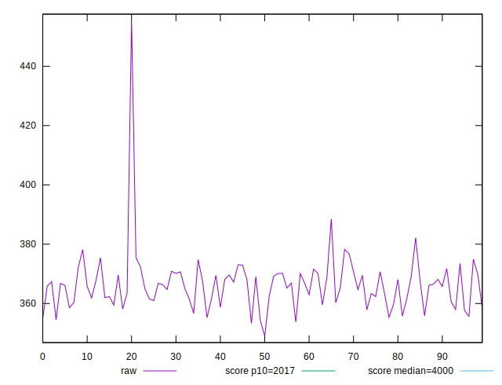
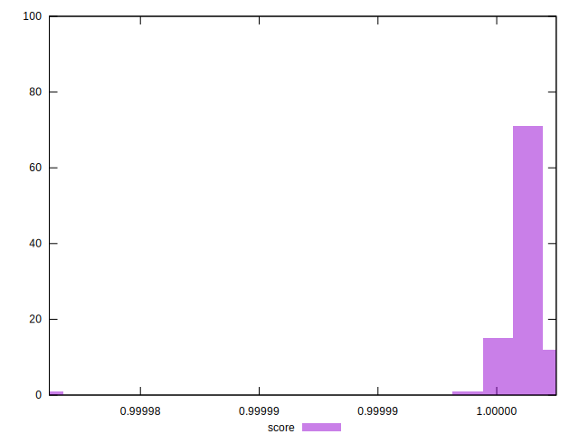

# //mainthread-work-breakdown/samples/pages+cached+noexternal+nofonts+nosvg+noimg+nocss

[→ Parent](../..)


## Raw


```yaml
p90min: 355.08799999999997
p90max: 378.18000000000006
p90range: 23.0920000000001
p90mean: 365.689010989011
p90median: 366.36400000000003
p90stdev: 5.563015123439408
p90skewness: -0.09481574654168615
p90eccentricity: 0.9999999999999996
p90discretization: 1
outlandishness: 1.0042690937197132

```


## Score


```yaml
p90min: 0.9999949379639279
p90max: 0.9999970768783875
p90range: 0.000002138914459548502
p90mean: 0.9999961724124302
p90median: 0.9999961513475866
p90stdev: 5.116090788531196e-7
p90skewness: -0.2013489536487378
p90eccentricity: 0.9999999999999993
p90discretization: 1.0340909090909092
outlandishness: 0.9999996390726037

```


## P Score


```yaml
p90min: 0.9999949379639279
p90max: 0.9999970768783875
p90range: 0.000002138914459548502
p90mean: 0.9999961724124302
p90median: 0.9999961513475866
p90stdev: 5.116090788531196e-7
p90skewness: -0.2013489536487378
p90eccentricity: 0.9999999999999993
p90discretization: 1.0340909090909092
outlandishness: 0.9999996390726037

```


## Score Difference


```yaml
p90min: 0.0000029231216125413795
p90max: 0.000005062036072089882
p90range: 0.000002138914459548502
p90mean: 0.000003827587569594525
p90median: 0.000003848652413429576
p90stdev: 5.116090788531196e-7
p90skewness: 0.20134895475046036
p90eccentricity: 1
p90discretization: 1.0340909090909092
outlandishness: 1.0965188928575331

```


## P Score Difference


```yaml
p90min: 0
p90max: 0
p90range: 0
p90mean: 0
p90median: 0
p90stdev: 0
p90skewness: .nan
p90eccentricity: .nan
p90discretization: 91
outlandishness: .nan

```

