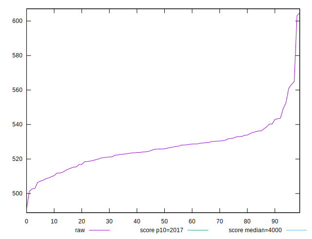
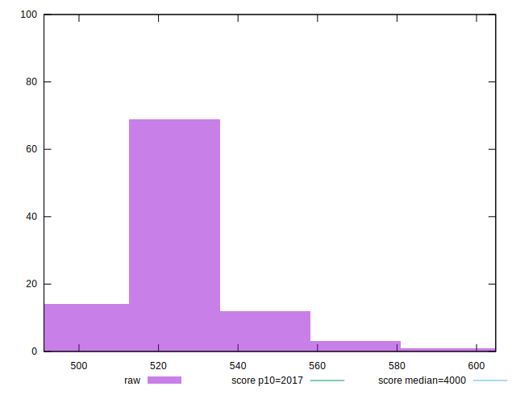
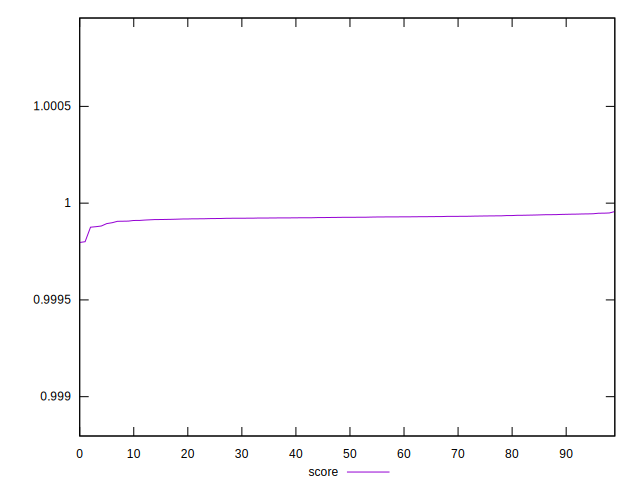

# //mainthread-work-breakdown/samples/pages+cached+noexternal+nofonts+nosvg+noimg

[→ Parent](../..)


## Raw


```yaml
p90min: 491.1840000000001
p90max: 540.3079999999999
p90range: 49.123999999999796
p90mean: 523.4203555555553
p90median: 524.6219999999998
p90stdev: 9.516145076554068
p90skewness: -0.7595098376069135
p90eccentricity: 1.0000000000000002
p90discretization: 1
outlandishness: 1.0151321354219895

```


## Score


```yaml
p90min: 0.9997967906032095
p90max: 0.999941793445212
p90range: 0.00014500284200247293
p90mean: 0.9999210005862013
p90median: 0.9999254274310533
p90stdev: 0.000022116106681982414
p90skewness: -3.933401895391214
p90eccentricity: 0.9999999999999999
p90discretization: 1
outlandishness: 1.0000050931901097

```

