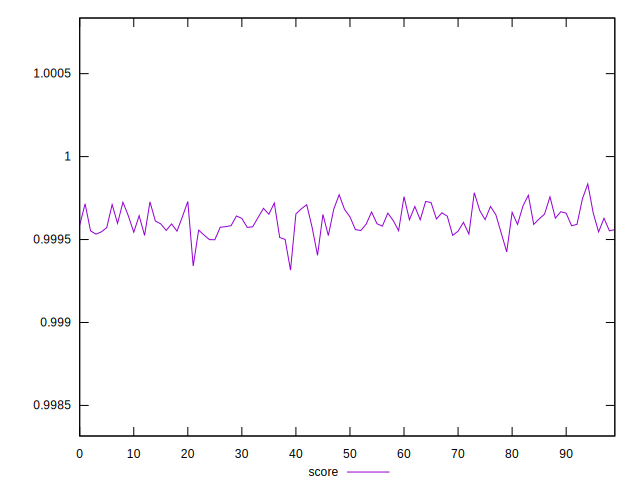
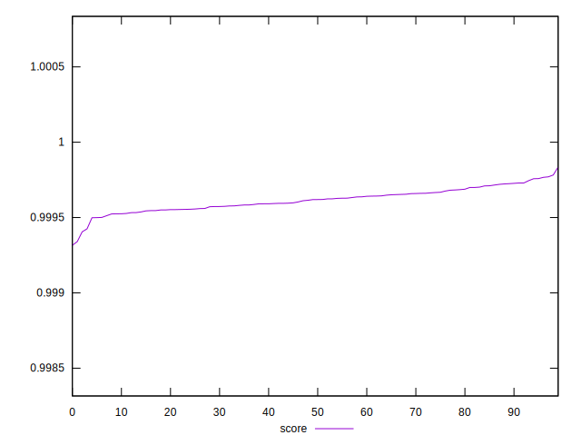

# //mainthread-work-breakdown/samples/pages+cached+noexternal+nofonts

[→ Parent](../..)


## Raw


```yaml
p90min: 587.2280000000002
p90max: 684.2519999999998
p90range: 97.02399999999966
p90mean: 657.0476444444448
p90median: 659.9320000000002
p90stdev: 19.58185907546465
p90skewness: -0.9054680047856636
p90eccentricity: 1.0000000000000007
p90discretization: 1
outlandishness: 1.012480523683812

```


## Score


```yaml
p90min: 0.9993156727224216
p90max: 0.9997247283984185
p90range: 0.0004090556759969166
p90mean: 0.9995991412410923
p90median: 0.9995964303374194
p90stdev: 0.00007670397130463748
p90skewness: -1.0106936678140777
p90eccentricity: 1
p90discretization: 1
outlandishness: 1.0000322128544876

```

