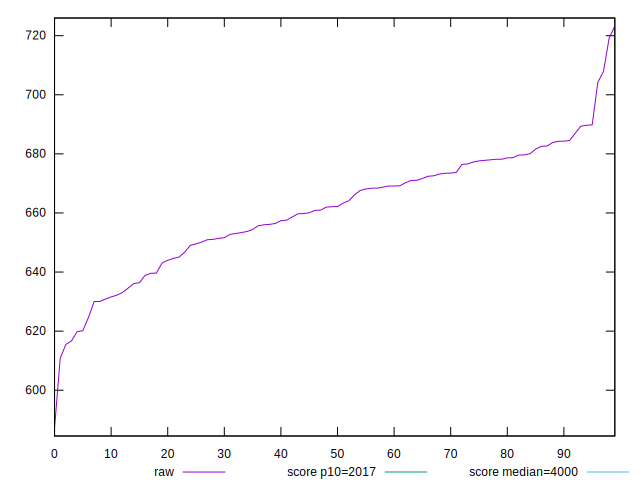
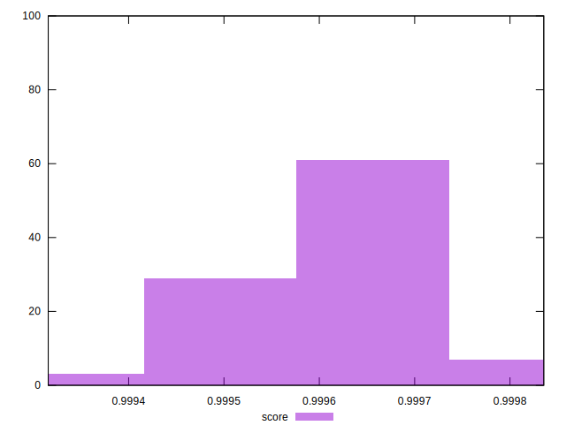

# //mainthread-work-breakdown/samples/pages+cached+noexternal+nofonts

[→ Parent](../..)


## Raw


```yaml
p90min: 620.1280000000008
p90max: 689.8240000000005
p90range: 69.69599999999969
p90mean: 661.6360439560444
p90median: 662.1920000000003
p90stdev: 17.037713229362087
p90skewness: -0.410025963040654
p90eccentricity: 0.9999999999999992
p90discretization: 1
outlandishness: 0.998486254472283

```


## Score


```yaml
p90min: 0.9994986515218454
p90max: 0.9997576867650021
p90range: 0.00025903524315673554
p90mean: 0.9996167544841665
p90median: 0.999619055657714
p90stdev: 0.00006485001929861779
p90skewness: 0.18139594929923783
p90eccentricity: 1.0000000000000004
p90discretization: 1
outlandishness: 0.9999969720380641

```

