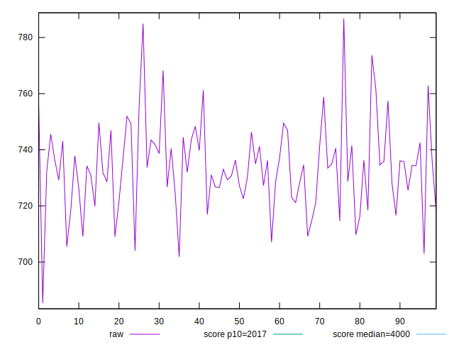
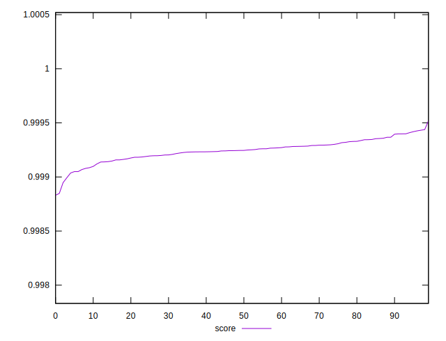

# //mainthread-work-breakdown/samples/pages+cached+noexternal+noimg

[→ Parent](../..)


## Raw


```yaml
p90min: 705.4720000000007
p90max: 761.2760000000006
p90range: 55.803999999999974
p90mean: 733.1281318681322
p90median: 734.2719999999998
p90stdev: 12.548020625141742
p90skewness: -0.000012984857933221791
p90eccentricity: 1.0000000000000002
p90discretization: 1
outlandishness: 1.0019849977861308

```


## Score


```yaml
p90min: 0.9990686142849088
p90max: 0.999432158478992
p90range: 0.0003635441940832429
p90mean: 0.9992577734189082
p90median: 0.9992509518523242
p90stdev: 0.00008136065086977586
p90skewness: 0.015212142950013344
p90eccentricity: 1.0000000000000004
p90discretization: 1
outlandishness: 0.9999678410340674

```

