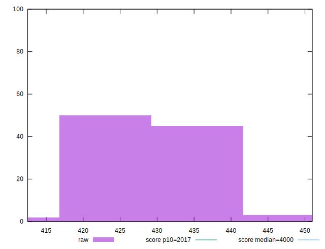
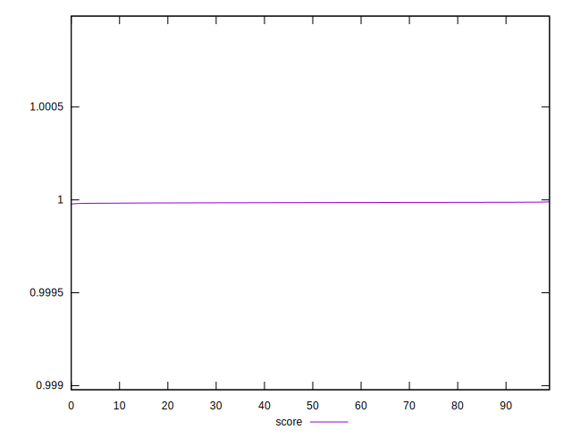

# //mainthread-work-breakdown/samples/pages+cached+noexternal+nojs

[→ Parent](../..)


## Raw


```yaml
p90min: 418.80799999999994
p90max: 439.76400000000007
p90range: 20.95600000000013
p90mean: 428.8273406593405
p90median: 428.69599999999986
p90stdev: 5.043526492183605
p90skewness: 0.20506299493267025
p90eccentricity: 1.0000000000000002
p90discretization: 1
outlandishness: 1.0034225717865695

```


## Score


```yaml
p90min: 0.9999820445777861
p90max: 0.999987983887406
p90range: 0.0000059393096198956385
p90mean: 0.9999853327419087
p90median: 0.9999854265178014
p90stdev: 0.0000014295595332468808
p90skewness: -0.34580422354394125
p90eccentricity: 1.0000000000000009
p90discretization: 1.011111111111111
outlandishness: 0.9999995056986846

```


## P Score


```yaml
p90min: 0.9999820445777861
p90max: 0.999987983887406
p90range: 0.0000059393096198956385
p90mean: 0.9999853327419087
p90median: 0.9999854265178014
p90stdev: 0.0000014295595332468808
p90skewness: -0.34580422354394125
p90eccentricity: 1.0000000000000009
p90discretization: 1.011111111111111
outlandishness: 0.9999995056986846

```


## Score Difference


```yaml
p90min: 0.000012016112594048778
p90max: 0.000017955422213944416
p90range: 0.0000059393096198956385
p90mean: 0.000014667258091357763
p90median: 0.00001457348219857657
p90stdev: 0.0000014295595332468808
p90skewness: 0.3458042241097642
p90eccentricity: 1.0000000000000004
p90discretization: 1.011111111111111
outlandishness: 1.0339844444421153

```


## P Score Difference


```yaml
p90min: 0
p90max: 0
p90range: 0
p90mean: 0
p90median: 0
p90stdev: 0
p90skewness: .nan
p90eccentricity: .nan
p90discretization: 91
outlandishness: .nan

```

