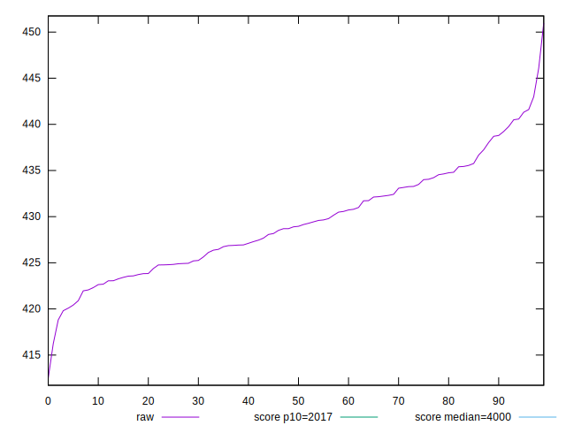

# //mainthread-work-breakdown/samples/pages+cached+noexternal+nojs

[→ Parent](../..)


## Raw


```yaml
p90min: 412.49599999999987
p90max: 438.70400000000006
p90range: 26.208000000000197
p90mean: 428.15795555555553
p90median: 428.11800000000005
p90stdev: 5.134993852449233
p90skewness: -0.21315819758642868
p90eccentricity: 1.0000000000000002
p90discretization: 1
outlandishness: 1.0065625399463425

```


## Score


```yaml
p90min: 0.9999779801205365
p90max: 0.9999870421686924
p90range: 0.000009062048155872304
p90mean: 0.9999847839661827
p90median: 0.9999851672387325
p90stdev: 0.000001761079682548261
p90skewness: -1.1305889901665707
p90eccentricity: 1.0000000000000004
p90discretization: 1.0112359550561798
outlandishness: 1.0000006032665958

```

