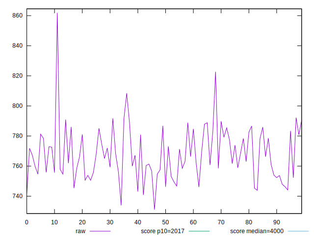
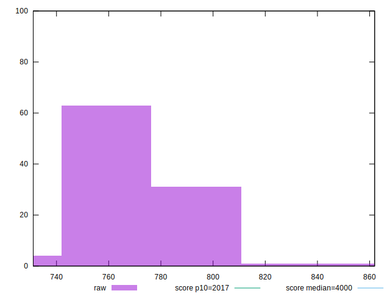
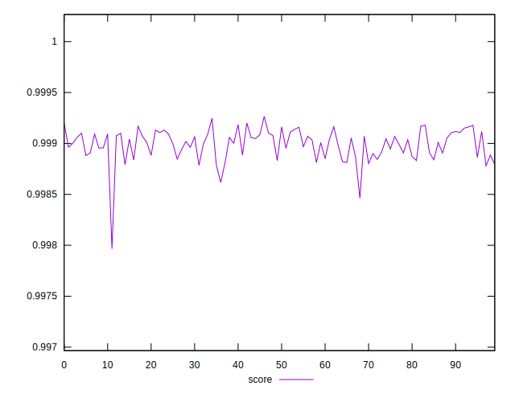

# //mainthread-work-breakdown/samples/pages+cached+noexternal+nosvg

[→ Parent](../..)


## Raw


```yaml
p90min: 731.0800000000007
p90max: 788.8599999999997
p90range: 57.77999999999895
p90mean: 764.0534666666671
p90median: 761.808
p90stdev: 14.140454387795764
p90skewness: 0.01824226908187068
p90eccentricity: 1
p90discretization: 1
outlandishness: 1.0101913358620098

```


## Score


```yaml
p90min: 0.997966367600216
p90max: 0.9991626395851583
p90range: 0.001196271984942321
p90mean: 0.9989628414761677
p90median: 0.9989987531812818
p90stdev: 0.00016671735199611908
p90skewness: -2.682921925765672
p90eccentricity: 1.0000000000000004
p90discretization: 1
outlandishness: 1.0000466638471002

```

