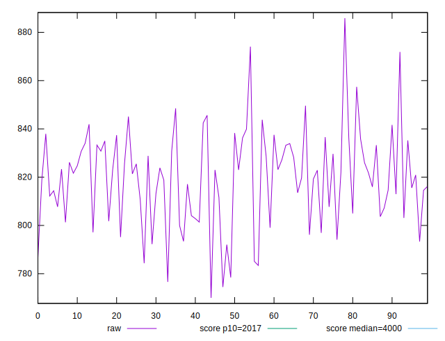
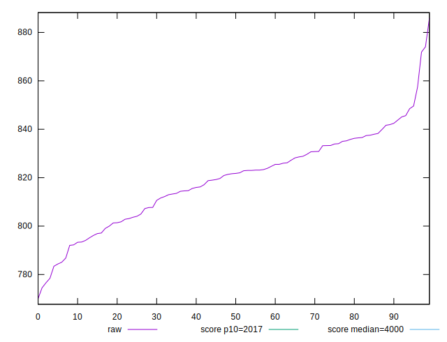
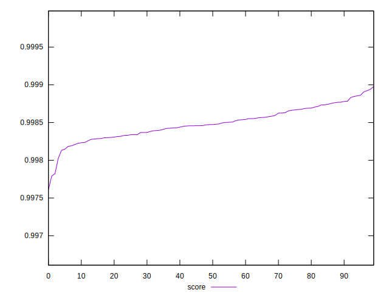

# //mainthread-work-breakdown/samples/pages+cached+noexternal

[→ Parent](../..)


## Raw


```yaml
p90min: 784.3439999999996
p90max: 849.6120000000006
p90range: 65.26800000000105
p90mean: 819.5152527472533
p90median: 821.7680000000009
p90stdev: 16.127801955788417
p90skewness: -0.2792619329494485
p90eccentricity: 0.9999999999999993
p90discretization: 1
outlandishness: 0.9999163114300914

```


## Score


```yaml
p90min: 0.9981331478041653
p90max: 0.9988536237071378
p90range: 0.0007204759029725283
p90mean: 0.9984899869481376
p90median: 0.9984727162290572
p90stdev: 0.00017823260938744733
p90skewness: 0.12603346048582664
p90eccentricity: 0.9999999999999997
p90discretization: 1
outlandishness: 0.9999890771664239

```

